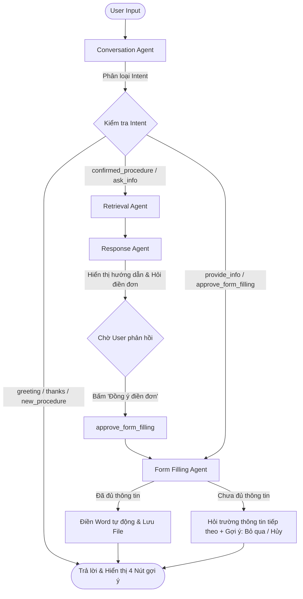

# 🏛️ CIVI AI Agent - Trợ lý Hành chính Công Đa nhiệm

CIVI AI Agent là hệ thống trợ lý ảo thông minh, giúp người dân tra cứu thông tin thủ tục hành chính công và điền các biểu mẫu, đơn tờ khai (Word/DOCX) tự động thông qua giao tiếp tự nhiên (Multi-agent RAG kết hợp Dynamic Form Filling).

---

## 🗺️ Luồng xử lý dữ liệu (Pipeline)

Hệ thống được thiết kế theo kiến trúc đồ thị trạng thái (**LangGraph StateGraph**), cho phép chuyển đổi linh hoạt giữa các Agent dựa trên ý định của người dùng:



### Chi tiết các Node trong Pipeline:
1. **Conversation Agent**: Tiếp nhận tin nhắn. Phân loại ý định người dùng (`Intent`) và trích xuất thực thể (`extracted_info` như họ tên, địa chỉ, số tầng...). 
   - Đồng thời, Agent sinh ra **4 phương án gợi ý (suggestions)** thay đổi động để hướng dẫn người dùng click chọn nhanh.
2. **Retrieval Agent (RAG)**: Tìm kiếm các tài liệu, hướng dẫn thủ tục liên quan trong cơ sở dữ liệu vector dựa trên từ khóa thủ tục đã được làm rõ.
3. **Response Agent**: Tổng hợp tài liệu RAG thành hướng dẫn 3 phần chuẩn (Trình tự, Cách thức thực hiện, Hồ sơ).
   - Nếu thủ tục có mẫu đơn Word đi kèm, Agent sẽ hiển thị lời đề nghị điền đơn tự động và tạo nút **[Đồng ý điền đơn]**.
4. **Form Filling Agent**: Quản lý quy trình điền đơn. Dựa trên tệp cấu hình biểu mẫu đã chuẩn hóa để hỏi người dùng từng câu, điền vào file Word và xuất ra thư mục `output`.

---

## 🔍 Kỹ thuật RAG (Retrieval-Augmented Generation)

Hệ thống RAG của CIVI được thiết kế chuyên biệt để xử lý các tài liệu pháp lý phức tạp từ Cổng dịch vụ công:

### 1. Ingestion & Trích xuất (Document Parsing)
- Sử dụng thư viện **Docling** để phân tích tài liệu PDF dịch vụ công thành cấu trúc Markdown chuẩn, giữ nguyên định dạng bảng biểu, cấu trúc đề mục chính xác.
- Chia nhỏ tài liệu (Chunking) theo cấu trúc chương mục tự nhiên thay vì phân tách theo số ký tự cứng nhắc, giúp giữ nguyên ngữ cảnh pháp lý.

### 2. Embeddings & Lưu trữ (Vector Database)
- **Mô hình Vector hóa**: Sử dụng mô hình cục bộ `sentence-transformers/all-MiniLM-L6-v2` để chuyển hóa văn bản thành vector.
- **Cơ sở dữ liệu Vector**: Sử dụng **ChromaDB** để lưu trữ và truy vấn tương đồng ngữ nghĩa nhanh chóng.

### 3. Tìm kiếm lai (Hybrid Retrieval Strategy)
Khi nhận yêu cầu, hệ thống kết hợp:
- **Truy vấn ngữ nghĩa (Vector Search)**: Tìm kiếm các chunk tài liệu có nội dung tương đồng với câu hỏi hoặc từ khóa thủ tục.
- **Truy vấn Siêu dữ liệu (Metadata Mapping)**: Khớp mã số thủ tục với thông tin cơ quan thực hiện, cấp thực hiện trong hệ thống file dữ liệu gốc (`procedures.json`, `forms.csv`, `phan_loai_tthc.json`).

---

## 📝 Cơ chế Điền biểu mẫu động (Dynamic Form Filling)

Hệ thống điền biểu mẫu tránh được tình trạng bỏ sót các trường thông tin nhờ vào hai lớp xử lý:

### 1. Chuẩn hóa Biểu mẫu thành JSON (`config/standardized_form_fields.json`)
- Hệ thống quét qua các file `.docx` mẫu, dùng giải thuật phân tích cấu trúc để dò tìm tất cả khoảng trống (`...`, `___`, `……`) trong cả **đoạn văn (Paragraphs)** và **bảng biểu (Tables)**.
- Dùng LLM làm sạch nhãn, loại bỏ phần ký tên/phê duyệt của cơ quan nhà nước, thiết lập câu hỏi tương ứng và lưu thành CSDL JSON. Điều này giúp:
  - Tốc độ hỏi đáp tức thì (không tốn thời gian gọi LLM sinh câu hỏi online).
  - Độ chính xác 100%, không bị sót trường thông tin trong bảng biểu.

### 2. Tự động thay thế thông minh (Dynamic Replacement)
- Sử dụng thư viện `python-docx` quét qua tệp tin Word và thay thế chính xác các khoảng trống tương ứng bằng dữ liệu người dùng đã cung cấp, bảo toàn định dạng văn bản gốc.

---

## 🚀 Hướng dẫn cài đặt và chạy ứng dụng (Setup & Running Guide)

### Bước 1: Chuẩn bị môi trường Python
Yêu cầu Python từ 3.10 trở lên. Khởi tạo môi trường ảo và cài đặt thư viện cần thiết:
```bash
# Tạo môi trường ảo
python -m venv .venv

# Kích hoạt môi trường ảo (Windows PowerShell)
.\.venv\Scripts\Activate.ps1

# Cài đặt thư viện phụ thuộc
pip install -r requirement.txt
```

### Bước 2: Thiết lập file khóa bảo mật (.env)
Tạo file `.env` ở thư mục gốc của dự án và điền API keys của bạn:
```env
groq=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
germini=AQ.Ab8RN6L-6ga2Nrl8mXn3DC72XySCgpy6lDhiDVv0EgMe1SmwLQ
```

### Bước 3: Nạp dữ liệu Vector RAG (Injest Data)
Để thiết lập cơ sở dữ liệu vector RAG từ file dữ liệu crawl thô vào ChromaDB, hãy chạy lệnh:
```bash
$env:PYTHONIOENCODING="utf-8"; .\.venv\Scripts\python.exe ingest.py
```

### Bước 4: Khởi chạy Giao diện Web (Streamlit App)
Để chạy giao diện chatbot thông minh và trải nghiệm:
```bash
$env:PYTHONIOENCODING="utf-8"; .\.venv\Scripts\streamlit.exe run app.py
```
Sau đó mở trình duyệt truy cập đường dẫn: **http://localhost:8501**

### Bước 5: Khởi chạy API Backend (FastAPI Server)
Để chạy API phục vụ việc tích hợp vào hệ thống khác (như Widget hay cổng dịch vụ):
```bash
$env:PYTHONIOENCODING="utf-8"; .\.venv\Scripts\python.exe main_api.py
```
Sau đó bạn có thể truy cập tài liệu API tự động (Swagger UI) tại: **http://localhost:8000/docs**

---

## 📁 Cấu trúc Thư mục Dự án (Project Directory Structure)

Dưới đây là sơ đồ cấu trúc của dự án chuẩn bị cho việc đẩy lên GitHub:

```bash
civi-project/
├── .gitignore                   # Loại bỏ venv, db, output, file .env khỏi Git
├── README.md                    # Hướng dẫn dự án và luồng xử lý RAG & Đồ thị Agent
├── app.py                       # Ứng dụng Web giao diện Demo Streamlit chính
├── main_api.py                  # API Backend viết bằng FastAPI cho tích hợp bên ngoài [NEW]
├── main.py                      # CLI entrypoint chạy thử nghiệm luồng
├── ingest.py                    # Script nạp dữ liệu thô vào ChromaDB
├── requirement.txt              # Danh sách thư viện Python cần cài đặt (Cập nhật mới)
│
├── config/                      # Thư mục cấu hình prompts và CSDL biểu mẫu chuẩn
│   ├── conversation_prompt.txt  # Hướng dẫn Agent giao tiếp làm rõ nhu cầu
│   ├── response_prompt.txt      # Định dạng biên soạn nội dung RAG của Response Agent
│   └── standardized_form_fields.json # CSDL biểu mẫu đã số hóa

│
├── scripts/                     # Các script công cụ và chuyển đổi hỗ trợ
│   ├── check_templates.py       # Kiểm tra các placeholder trong Word
│   ├── convert_excel_to_json.py # Chuyển đổi dữ liệu excel sang json
│   └── read_excel.py            # Đọc file excel phục vụ tiền xử lý
│
├── src/                         # Mã nguồn cốt lõi của hệ thống
│   ├── config.py                # Quản lý cấu hình, đường dẫn
│   │
│   ├── agents/                  # Tập hợp các Agent và đồ thị LangGraph
│   │   ├── __init__.py
│   │   ├── state.py             # Định nghĩa cấu trúc AgentState lưu giữ ngữ cảnh
│   │   ├── llm.py               # Lớp giao tiếp Gemini (SDK mới)/Groq (Fallback)
│   │   ├── graph.py             # Định nghĩa luồng di chuyển và logic định tuyến (Routing)
│   │   ├── conversation_agent.py # Agent tiếp nhận, làm rõ nhu cầu và sinh suggestions
│   │   ├── retrieval_agent.py   # Agent truy vấn ChromaDB
│   │   ├── response_agent.py    # Agent biên soạn nội dung hướng dẫn thủ tục
│   │   └── form_filling_agent.py # Agent hỏi đáp và điền thông tin tự động vào file Word
│   │
│   ├── ingestion/               # Các kịch bản nạp và tiền xử lý dữ liệu
│   │   ├── __init__.py
│   │   ├── metadata_loader.py   # Đọc danh sách thủ tục, biểu mẫu ánh xạ
│   │   └── standardize_forms.py # Script quét Word tự động để sinh CSDL JSON biểu mẫu
│   │
│   └── data/                    # Các file JSON phân loại dữ liệu thủ tục
│       ├── phan_loai_tthc.json  # Phân loại 207 thủ tục dịch vụ công
│       └── cay_hoi_ai.json      # Danh sách câu hỏi lọc phục vụ debug
│
├── output/                      # Thư mục chứa các file Word đã điền sẵn thông tin (Bị Gitignore)
└── dichvucong_xay_dung_crawled_2026-07-17/ # Dữ liệu gốc (PDF, Word mẫu - Bị Gitignore)
```

