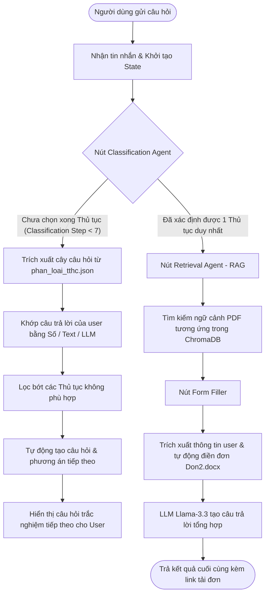

# Phân Tích Luồng Xử Lý (Pipeline) & Nghiệp Vụ CIVI Agent

Chào bạn, câu hỏi rất hay! Để bạn hiểu rõ bản chất luồng hoạt động của CIVI AI Agent và khẳng định rằng **không hề có việc fix cứng prompt hay fix cứng câu trả lời**, dưới đây là sơ đồ pipeline chi tiết và phân tích luồng code thực tế.

## 1. Sơ đồ Pipeline Luồng Xử Lý (LangGraph)

Dưới đây là sơ đồ cách tin nhắn của bạn được chuyển qua các nút xử lý trong LangGraph:



---

## 2. Giải thích tại sao khi bạn hỏi *"Tôi muốn làm thủ tục đất đai"*, AI trả về danh sách 7 nhóm nhu cầu?

Đây là cơ chế **Cây Phân Loại Động 7 Bước** được sinh tự động dựa trên file dữ liệu [phan-loai-tthc-cho-ai-agent.xlsx](file:///c:/Users/Admin/Downloads/civi%20project/dichvucong_xay_dung_crawled_2026-07-17/phan-loai-tthc-cho-ai-agent.xlsx) chứ không phải code tĩnh.

### Bước 1: Khởi tạo danh sách ứng viên (Candidates)
Khi bạn bắt đầu hội thoại, biến trạng thái `classification_step` mặc định bằng `1`. Ở bước này, hệ thống sẽ lấy toàn bộ **207 thủ tục hành chính** làm danh sách ứng viên ban đầu (`candidates = self.phan_loai`).
*(File nguồn: [classification_agent.py:L24-L25](file:///c:/Users/Admin/Downloads/civi%20project/src/agents/classification_agent.py#L24-L25))*

### Bước 2: Sinh câu hỏi động dựa trên dữ liệu hiện có
Ở bước 1 (`step == 1`), hệ thống gọi hàm `_get_question_and_options()` để tự động lấy tất cả các giá trị **không trùng lặp** của cột **`Nhóm đề mục`** từ 207 thủ tục đang có trong danh sách ứng viên:

```python
# Trích đoạn code động tại classification_agent.py (Dòng 113-116)
if step == 1:
    question = "Bạn đang cần giải quyết vấn đề thuộc nhóm nhu cầu nào?"
    # Trích xuất động các "Nhóm đề mục" duy nhất từ danh sách ứng viên
    options = sorted(list(set(str(c.get("Nhóm đề mục")) for c in candidates if c.get("Nhóm đề mục"))))
    return question, options
```
*(File nguồn: [classification_agent.py:L113-L116](file:///c:/Users/Admin/Downloads/civi%20project/src/agents/classification_agent.py#L113-L116))*

Vì trong tệp Excel/JSON của bạn, 207 thủ tục được chia làm 7 nhóm nhu cầu lớn, nên hàm này trả về đúng 7 lựa chọn đó:
1. *Công thương, kỹ thuật & an toàn*
2. *Du lịch, văn hóa & sáng tạo*
3. *Giao thông vận tải*
4. *Hành chính, tư pháp, an ninh & khác*
5. *Nông nghiệp, thủy lợi & thiên tai*
6. *Xây dựng, nhà ở & bất động sản*
7. *Đất đai*

---

## 3. Quá trình khớp câu trả lời (Không bị fix cứng)

Khi bạn gõ câu trả lời, hệ thống sẽ chạy qua 3 tầng lọc tại hàm `_process_user_response`:

1. **Khớp Số (Numeric Matching):** Nếu bạn gõ `"7"`, hệ thống tự chọn lựa chọn thứ 7 là `"Đất đai"`.
2. **Khớp Chuỗi (Text Matching):** Nếu bạn gõ `"đất đai"`, hệ thống tìm thấy từ khóa `"Đất đai"` trong danh sách lựa chọn.
3. **Khớp Ngữ Nghĩa bằng LLM (LLM Fallback):** Nếu bạn gõ một câu tự nhiên như *"mình muốn làm sổ đỏ ruộng vườn"*, hệ thống sẽ dùng mô hình `llama-3.3-70b-versatile` để phân tích ngữ nghĩa xem ý định này thuộc về nhóm nào trong 7 nhóm trên.

Sau khi khớp được nhóm **"Đất đai"**, hệ thống sẽ áp dụng bộ lọc:
`filters["Nhóm đề mục"] = "Đất đai"` và lọc danh sách ứng viên chỉ giữ lại các thủ tục thuộc nhóm Đất đai. 

Tiếp theo, bước phân loại tăng lên `classification_step = 2`, và hệ thống sẽ lại tự động quét danh sách các ứng viên còn lại để lấy ra danh sách các **`Lĩnh vực chuẩn hóa`** thuộc nhóm Đất đai để hỏi bạn câu hỏi thứ 2!

```python
elif step == 2:
    question = "Nhu cầu của bạn thuộc lĩnh vực cụ thể nào?"
    options = sorted(list(set(str(c.get("Lĩnh vực chuẩn hóa")) for c in candidates if c.get("Lĩnh vực chuẩn hóa"))))
    return question, options
```

Như vậy, toàn bộ luồng hỏi-đáp hoàn toàn là **động** (data-driven), tự thích ứng dựa trên danh sách thủ tục và các cột thuộc tính tương ứng trong file dữ liệu Excel ban đầu!
