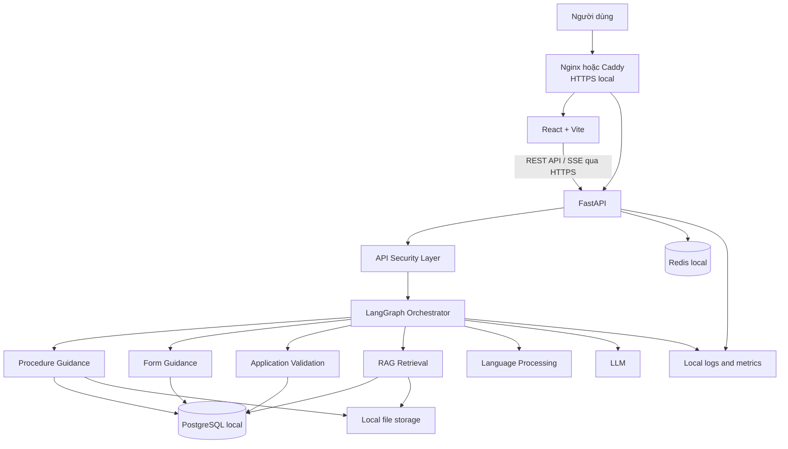
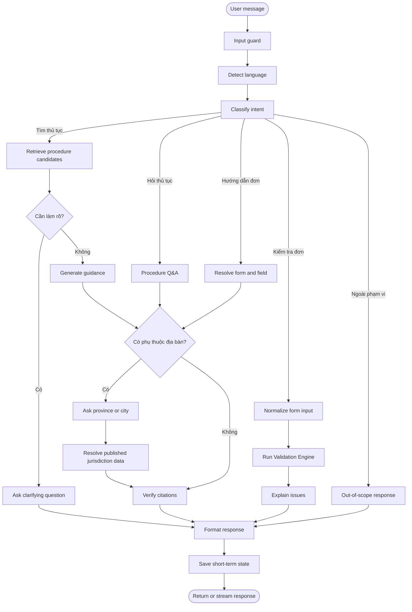
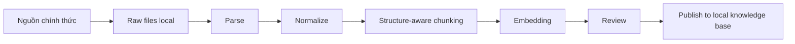
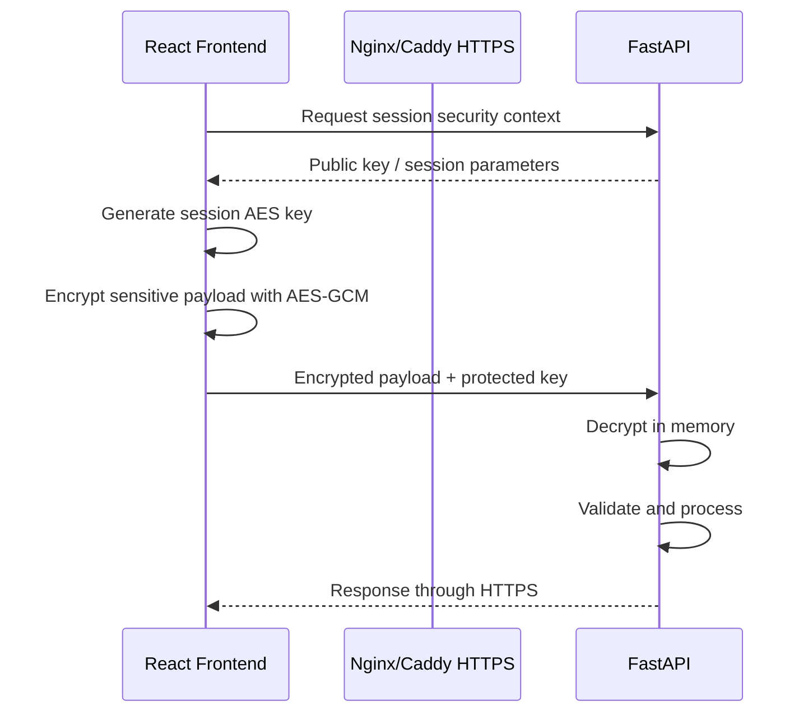

# ICIVI — Kiến trúc công nghệ Version 1

## 1. Mục tiêu tài liệu

Tài liệu này mô tả kiến trúc công nghệ tổng thể cho ICIVI Version 1 theo phạm vi trong `00-overview.md`.

Version 1 tập trung vào:

- Chatbot được truy cập qua giao diện web.
- Không yêu cầu đăng nhập hoặc xác thực danh tính.
- Mỗi người dùng làm việc trong một phiên chat độc lập.
- Hỏi đáp thủ tục hành chính có nguồn tham chiếu.
- Tư vấn lựa chọn thủ tục và biểu mẫu.
- Hướng dẫn điền từng trường trong đơn.
- Kiểm tra sơ bộ nội dung đơn trước khi nộp.
- Có khả năng mở rộng sang tiếng Thái tại Việt Nam.
- Toàn bộ thành phần lưu trữ và xử lý chạy trên máy chủ LAN/internal trong Version 1.

Tài liệu này chỉ mô tả kiến trúc và trách nhiệm của các thành phần. Thiết kế bảng dữ liệu, JSON Schema, validation rule schema và cấu trúc lưu trữ chi tiết được mô tả trong `02-schema.md`.

---

## 2. Nguyên tắc kiến trúc Version 1

### 2.1 LAN/internal-first

Version 1 được triển khai bằng Docker Compose trên một máy chủ LAN/internal:

- Frontend được build thành static files và phục vụ qua reverse proxy HTTPS.
- FastAPI, PostgreSQL, Redis và file storage chạy trong mạng Docker nội bộ.
- File biểu mẫu, văn bản và dữ liệu RAG được lưu trên ổ đĩa của máy chủ.
- LLM có thể là model local hoặc API bên ngoài theo cấu hình server-side.

Development chạy trên localhost. Môi trường LAN/internal chỉ expose reverse proxy; không public trực tiếp FastAPI, PostgreSQL hoặc Redis ra Internet.

Version 1 không phụ thuộc vào:

- S3 cloud.
- Managed database.
- Managed Redis.
- Kubernetes.
- Hệ thống microservice phân tán.

### 2.2 Runtime baseline

- Python 3.12 là runtime cho Docker image và CI; metadata dependency dùng `>=3.12,<3.14`.
- Trước khi triển khai phải khóa phiên bản Node.js, PostgreSQL kèm pgvector, Redis và Docker Compose trong manifest hoặc image tag.
- Mọi thay đổi runtime version phải được kiểm thử tương thích dependency trước khi nâng production.

### 2.3 Modular monolith

Backend được triển khai dưới dạng một ứng dụng FastAPI duy nhất, bên trong chia thành các module logic:

- Conversation orchestration.
- Procedure guidance.
- Form guidance.
- Application validation.
- RAG retrieval.
- Language processing.
- Session management.

Cách tiếp cận này phù hợp với Version 1 vì:

- Dễ triển khai trên một máy.
- Dễ debug.
- Dễ backup.
- Giảm giao tiếp mạng giữa các service.
- Không cần vận hành nhiều hệ thống độc lập.

### 2.4 Session-based, không có tài khoản

- Mỗi lượt truy cập tạo một `session_id` ngẫu nhiên.
- Session không đại diện cho danh tính người dùng.
- Không dùng CCCD, số điện thoại hoặc email làm session key.
- State hội thoại hết hạn sau 30 phút không hoạt động.
- Người dùng có thể xóa phiên hoặc bắt đầu phiên mới.
- Không có long-term memory theo người dùng trong Version 1.
- Redis không persistence hoặc backup state chứa PII; form input, validation result và history bị xóa khi session hết hạn hoặc bị xóa thủ công.

### 2.5 LLM không tự đưa ra quyết định hành chính

LLM được dùng để:

- Hiểu câu hỏi tự nhiên.
- Phân loại nhu cầu.
- Trích xuất thông tin từ câu người dùng.
- Tạo câu hỏi làm rõ.
- Diễn giải hướng dẫn.
- Giải thích kết quả kiểm tra.
- Hỗ trợ đa ngôn ngữ.

LLM không được tự quyết định:

- Thành phần hồ sơ bắt buộc.
- Trường bắt buộc trong biểu mẫu.
- Điều kiện pháp lý.
- Lệ phí.
- Thời hạn giải quyết.
- Cơ quan tiếp nhận.
- Hồ sơ hợp lệ hay không.

Các nội dung này phải đến từ dữ liệu đã chuẩn hóa và Validation Engine.

Khi dùng LLM API bên ngoài, frontend phải lấy consent rõ ràng trước khi gửi nội dung người dùng. Provider, model, data handling và retention phải được cấu hình server-side và công bố trong release gate; không đưa API key hoặc chính sách provider vào frontend.

### 2.6 Schema-driven

Luồng xử lý không được viết riêng cho từng loại đơn.

Mỗi biểu mẫu cần có cấu hình mô tả:

- Các nhóm thông tin.
- Các trường dữ liệu.
- Trường bắt buộc và tùy chọn.
- Hướng dẫn điền.
- Ví dụ.
- Validation rules.
- Quan hệ giữa các trường.
- Phiên bản hiệu lực.

Chi tiết cấu trúc cấu hình được mô tả trong `02-schema.md`.

---

## 3. Stack công nghệ đề xuất

| Lớp | Công nghệ | Vai trò |
|---|---|---|
| Frontend | React + TypeScript + Vite | Chat UI, form động, hiển thị hướng dẫn và lỗi |
| Backend | FastAPI + Python 3.12 | API, xử lý phiên, gọi graph, validation và RAG |
| Workflow | LangGraph | Điều phối luồng hội thoại và state theo phiên |
| Session/cache | Redis local | Session TTL, cache, rate limit và trạng thái request |
| Dữ liệu ứng dụng | PostgreSQL local | Lưu dữ liệu thủ tục, biểu mẫu và metadata |
| Vector retrieval | pgvector trong PostgreSQL | Tìm kiếm ngữ nghĩa cho RAG |
| File storage | Local filesystem | Lưu PDF, DOCX, JSON nguồn và file đã xử lý |
| Reverse proxy | Nginx hoặc Caddy | HTTPS, routing và giới hạn request trên LAN/internal |
| LLM | Local model hoặc model API | Hiểu ngôn ngữ, structured output và diễn giải; API ngoài yêu cầu consent |
| Container | Docker Compose | Chạy đồng bộ các thành phần trên một máy |
| Monitoring | Log file + metric local | Theo dõi lỗi, latency và chất lượng hệ thống |

---

## 4. Sơ đồ kiến trúc tổng thể



### 4.1 Luồng triển khai trên một máy

```text
Browser
   |
   | HTTPS
   v
Nginx / Caddy
   |--------------------------|
   v                          v
React static files         FastAPI
                               |
                    |----------|----------|
                    v          v          v
               PostgreSQL   Redis    Local files
                    |
                 pgvector
```

### 4.2 Phạm vi local

Các đường dẫn lưu trữ có thể được mount qua Docker volumes:

```text
./data/postgres/
./data/redis/
./data/documents/
./data/models/
./data/logs/
./data/backups/
```

Không lưu dữ liệu quan trọng trực tiếp bên trong writable layer của container vì dữ liệu có thể mất khi recreate container.

---

## 5. Frontend — React + TypeScript + Vite

### 5.1 Vai trò

Frontend cung cấp giao diện tương tác cho người dân:

- Chat với ICIVI.
- Chọn thủ tục hoặc biểu mẫu.
- Xem checklist hồ sơ.
- Xem hướng dẫn từng bước.
- Nhập nội dung đơn.
- Xem lỗi kiểm tra theo từng trường.
- Chọn ngôn ngữ.
- Xóa phiên hoặc bắt đầu lại.

### 5.2 Các thành phần giao diện

#### Chat panel

- Hiển thị câu hỏi và câu trả lời.
- Hỗ trợ quick replies.
- Hiển thị streaming response.
- Hiển thị nguồn tham chiếu.
- Cho phép gửi feedback.

#### Procedure guidance

- Tên thủ tục.
- Đối tượng thực hiện.
- Thành phần hồ sơ.
- Trình tự.
- Nơi thực hiện.
- Thời hạn.
- Lệ phí nếu có.

#### Form guidance

- Hiển thị các nhóm trường.
- Giải thích ý nghĩa từng trường.
- Đánh dấu bắt buộc hoặc tùy chọn.
- Hiển thị ví dụ điền.

#### Application checker

- Render form từ schema do backend trả về.
- Hiển thị lỗi cạnh trường dữ liệu.
- Tổng hợp lỗi chặn, cảnh báo và gợi ý.
- Cho phép sửa và kiểm tra lại.

### 5.3 Quy tắc frontend

- Không hard-code cấu trúc từng loại đơn trong React component.
- Không gọi trực tiếp LLM từ frontend.
- Không đặt API key hoặc secret trong source code frontend.
- Không lưu nội dung đơn nhạy cảm vào `localStorage`.
- Chỉ lưu session token ngắn hạn trong memory hoặc cơ chế phù hợp với chính sách bảo mật.
- Validation frontend chỉ nhằm phản hồi nhanh; backend vẫn là nguồn kết quả chính thức của hệ thống.

---

## 6. Backend — FastAPI

### 6.1 Vai trò

FastAPI là lớp giao tiếp chính giữa frontend và các thành phần xử lý phía server:

- Tạo, đọc và xóa phiên chat.
- Nhận message từ frontend.
- Chuyển message vào LangGraph.
- Stream kết quả về frontend.
- Cung cấp dữ liệu thủ tục và biểu mẫu.
- Gọi Validation Engine.
- Gọi RAG retrieval.
- Áp dụng rate limit và giới hạn payload.
- Kiểm tra session token.
- Mã hóa, giải mã dữ liệu khi bật application-level encryption.
- Ghi log và metric đã loại bỏ thông tin nhạy cảm.

**Nhóm API ở mức kiến trúc:**

```text
/api/v1/sessions
/api/v1/chat
/api/v1/procedures
/api/v1/forms
/api/v1/validation
/api/v1/citations
/api/v1/security
/api/v1/health
```

Chi tiết request, response và schema của từng API sẽ được mô tả trong tài liệu API riêng.

---

## 7. Redis — Session và dữ liệu tạm thời

Redis local được sử dụng cho:

- Session state có TTL.
- State hội thoại ngắn hạn.
- Cache kết quả retrieval.
- Rate limiting.
- Theo dõi request đang stream.
- Distributed lock khi có nhiều backend worker.
- Optional LangGraph short-term checkpoint.

Redis không được coi là nguồn lưu trữ bền vững.

Session, graph state, form input và validation result dùng TTL 30 phút không hoạt động. Redis không bật persistence hoặc backup cho các key chứa PII; thao tác xóa session phải xóa toàn bộ key runtime gắn với session đó.

Khi session hết hạn hoặc người dùng chọn xóa phiên, hệ thống phải xóa:

- State hội thoại.
- Form input tạm thời.
- Streaming metadata.
- Cache gắn riêng với session.
- Checkpoint ngắn hạn của graph nếu có.

---

## 8. LangGraph — Điều phối luồng hội thoại

### 8.1 Vai trò

LangGraph được dùng để điều phối workflow, không dùng để xây multi-agent phức tạp trong Version 1.

Các trách nhiệm chính:

- Phân loại loại yêu cầu.
- Chọn luồng xử lý.
- Thu thập thông tin còn thiếu.
- Gọi procedure guidance.
- Gọi form guidance.
- Gọi validation.
- Gọi RAG.
- Kiểm tra fallback.
- Lưu state ngắn hạn theo session.

### 8.2 Graph đề xuất



### 8.3 Nguyên tắc triển khai graph

- Mỗi node chỉ thực hiện một trách nhiệm rõ ràng.
- Business logic phải nằm trong service hoặc Validation Engine, không viết toàn bộ trong node.
- Output của node LLM phải được validate theo structured schema.
- Mọi tool call phải thuộc allowlist.
- Graph phải có timeout và fallback.
- Không đưa toàn bộ file hoặc corpus RAG vào state.
- Không lưu secret hoặc API key trong graph state.
- Chỉ hỏi tỉnh hoặc thành phố khi intent cần nội dung theo địa bàn; chỉ hỏi cấp thấp hơn khi nguồn đã publish yêu cầu.
- Không thu địa chỉ đầy đủ mặc định; người dùng có thể đổi địa bàn trong cùng session.

---

## 9. Application Validation Engine

Validation Engine là thành phần xác định lỗi trong nội dung đơn.

### 9.1 Luồng xử lý

```text
Form input
   |
   v
Normalize data
   |
   v
Required and type validation
   |
   v
Field validation rules
   |
   v
Cross-field validation rules
   |
   v
Conditional document checks
   |
   v
Validation result
   |
   v
LLM explains the result
```

### 9.2 Nhóm kết quả

- `blocking_error`: phải sửa trước khi nộp.
- `warning`: nên kiểm tra lại.
- `suggestion`: gợi ý cải thiện.
- `unable_to_verify`: chưa có đủ dữ liệu hoặc căn cứ.

LLM chỉ diễn giải kết quả và không được tự thay đổi:

- Mã lỗi.
- Trường bị lỗi.
- Mức độ nghiêm trọng.
- Validation rule nguồn.

Cấu trúc chi tiết của form schema và validation rules được mô tả trong `02-schema.md`.

---

## 10. RAG và dữ liệu tài liệu local

### 10.1 Nguồn dữ liệu

- Cổng Dịch vụ công Quốc gia.
- Cổng dịch vụ công của bộ, ngành và địa phương.
- Văn bản pháp luật chính thức.
- File biểu mẫu chính thức.
- Hướng dẫn của cơ quan tiếp nhận.
- FAQ đã được kiểm duyệt.

### 10.2 Pipeline dữ liệu



### 10.3 Nguyên tắc retrieval

- Chỉ truy xuất dữ liệu đã được publish.
- Lọc theo thủ tục, phiên bản, phạm vi địa bàn và ngôn ngữ.
- Kết hợp semantic search và keyword search.
- Ưu tiên khớp chính xác mã biểu mẫu và số hiệu văn bản.
- Khi cùng áp dụng, ưu tiên nội dung đã publish theo địa phương hơn nội dung toàn quốc.
- Mọi câu trả lời pháp lý phải có citation truy vết source, version và phạm vi địa bàn.
- Khi không có đủ căn cứ, chatbot phải nói rõ giới hạn thay vì suy đoán.

Nếu không có dữ liệu đã publish cho địa bàn người dùng chọn, hệ thống chỉ trả nội dung toàn quốc có citation nếu có, nêu rõ giới hạn và dẫn tới cổng hoặc cơ quan tiếp nhận chính thức. Không dùng dữ liệu của địa phương khác làm thay thế.

### 10.5 Governance publish

- Mỗi nguồn, procedure version, form version và knowledge document có owner review/publish rõ ràng.
- Chỉ dữ liệu có trạng thái `published`, còn hiệu lực và có phạm vi địa bàn xác định mới được retrieval.
- Quy trình cập nhật phải lưu nguồn, version, thời gian hiệu lực và người duyệt để citation có thể truy vết.

### 10.4 File storage local

File gốc được lưu trong thư mục local có tổ chức, ví dụ:

```text
data/documents/
├── legal/
├── procedures/
├── forms/
├── normalized/
└── archived/
```

Cần lưu checksum để phát hiện file bị thay đổi hoặc trùng lặp.

---

## 11. Bảo mật giao tiếp giữa Frontend và Backend

### 11.1 Có nên mã hóa dữ liệu qua API?

**Có. Lớp mã hóa bắt buộc là HTTPS/TLS.**

Ngay cả khi frontend và backend chạy trên cùng một máy, HTTPS vẫn nên được bật khi:

- Người dùng truy cập qua mạng LAN.
- Hệ thống được publish qua domain hoặc public URL.
- Reverse proxy đứng trước FastAPI.
- Dữ liệu người dùng có thể chứa thông tin cá nhân.

TLS bảo vệ:

- Nội dung message.
- Dữ liệu người dùng nhập trong đơn.
- Session token.
- Kết quả validation.
- Streaming response.

### 11.2 Kiến trúc HTTPS development và LAN/internal

```text
Browser
   |
   | HTTPS / TLS
   v
Nginx hoặc Caddy
   |
   | HTTP nội bộ trên loopback hoặc Docker network
   v
FastAPI
```

Khuyến nghị:

- Chỉ expose cổng HTTPS của Nginx hoặc Caddy.
- Không expose trực tiếp cổng FastAPI ra Internet.
- FastAPI chỉ listen trên localhost hoặc private Docker network.
- Dùng certificate được client LAN tin cậy khi triển khai internal.
- Development localhost có thể dùng local certificate phục vụ phát triển.

### 11.3 Session token

Vì Version 1 không đăng nhập, hệ thống vẫn cần token phiên để ngăn việc đoán hoặc ghi đè session khác.

Session token nên:

- Có entropy cao và không tuần tự.
- Có thời gian hết hạn.
- Được ký hoặc ánh xạ tới session server-side.
- Chỉ gửi qua HTTPS.
- Không chứa dữ liệu cá nhân.
- Bị vô hiệu khi người dùng xóa phiên.

Frontend không nên ghi token vào URL query string vì URL có thể xuất hiện trong history hoặc log.

### 11.4 Mã hóa payload ở tầng ứng dụng

Có thể bổ sung **application-level encryption** cho các trường đặc biệt nhạy cảm, nhưng đây là lớp tăng cường, không thay thế HTTPS.

Phương án đề xuất:

1. FastAPI tạo khóa công khai hoặc thiết lập khóa phiên.
2. Frontend tạo khóa đối xứng ngẫu nhiên cho session.
3. Payload nhạy cảm được mã hóa bằng AES-256-GCM.
4. Khóa đối xứng được bảo vệ bằng khóa công khai của backend hoặc được dẫn xuất qua cơ chế trao đổi khóa an toàn.
5. Backend giải mã dữ liệu trong memory ngay trước khi validation.
6. Không ghi plaintext vào access log, error log hoặc trace.
7. Nonce/IV phải duy nhất cho mỗi payload.
8. Mỗi ciphertext phải có authentication tag để phát hiện chỉnh sửa.

Luồng khái quát:



### 11.5 Có nên bật application-level encryption ngay trong V1?

Đề xuất triển khai theo hai mức:

#### Mức bắt buộc cho V1

- HTTPS/TLS.
- Session token an toàn.
- Payload size limit.
- Rate limit.
- Mask dữ liệu nhạy cảm trong log.
- Không lưu raw form input lâu dài.
- Xóa session sau 30 phút không hoạt động hoặc ngay khi người dùng kết thúc phiên.

#### Mức tăng cường

- AES-GCM cho nhóm field nhạy cảm.
- Key rotation.
- Mã hóa response event nếu có yêu cầu đặc biệt.

Không nên tự xây thuật toán mã hóa riêng. Chỉ sử dụng thư viện mật mã đã được kiểm chứng.

Trong nhiều trường hợp, HTTPS kết hợp với kiểm soát log, session TTL và local disk encryption sẽ mang lại lợi ích bảo mật lớn hơn so với việc mã hóa toàn bộ JSON payload lần thứ hai.

### 11.6 Bảo vệ API bổ sung

- CORS chỉ cho phép origin frontend đã cấu hình.
- Giới hạn method và header.
- Kiểm tra `Content-Type`.
- Giới hạn kích thước message và form payload.
- Rate limit theo session và IP hash.
- Chặn request chứa file hoặc content type không được hỗ trợ.
- Không cho LLM truy cập trực tiếp database bằng câu SQL tự sinh.
- Tool call sử dụng allowlist.
- Redact dữ liệu nhạy cảm trước khi logging và tracing.

---

## 12. Bảo mật dữ liệu lưu trên máy local

Dù dữ liệu chỉ lưu local, vẫn cần bảo vệ máy chủ và ổ đĩa.

### 12.1 Nguyên tắc

- Dùng full-disk encryption của hệ điều hành nếu máy chứa dữ liệu thật.
- Docker volumes chỉ cấp quyền cho user/service cần thiết.
- Không commit file `.env`, khóa hoặc dữ liệu production vào Git.
- Database không expose ra mạng ngoài.
- Redis không expose công khai và phải có cấu hình bảo vệ phù hợp.
- Backup phải được mã hóa.
- File log không được chứa nội dung đơn đầy đủ.
- Có lịch xóa session, temporary file và cache.

### 12.2 Secrets

Secrets có thể được giữ trong:

- Local environment variables.
- Docker secrets nếu môi trường hỗ trợ.
- File secrets được giới hạn permission.

Không đặt secret trong:

- React bundle.
- Repository Git.
- Docker image.
- File tài liệu.

---

## 13. Đa ngôn ngữ và tiếng Thái Việt Nam

### 13.1 Luồng xử lý

```text
User message
   |
   v
Language detection
   |
   v
Normalize administrative terminology
   |
   v
Intent and retrieval
   |
   v
Grounded answer from approved sources
   |
   v
Generate or translate to user language
   |
   v
Terminology and citation verification
```

### 13.2 Nguyên tắc

- Xác định rõ biến thể tiếng Thái theo khu vực pilot.
- Không coi mọi biến thể tiếng Thái tại Việt Nam là một ngôn ngữ đồng nhất.
- Nội dung pháp lý gốc vẫn là tiếng Việt.
- Bản dịch hỗ trợ người dân hiểu, không thay thế văn bản pháp lý gốc.
- Tên văn bản và số hiệu được giữ nguyên bằng tiếng Việt.
- Thuật ngữ hành chính quan trọng cần được người bản ngữ kiểm duyệt.

### 13.3 Phạm vi Version 1

- UI chính bằng tiếng Việt.
- Hệ thống có trường `language_code` trong session và dữ liệu nội dung.
- Pilot một nhóm FAQ và một biểu mẫu bằng một biến thể tiếng Thái cụ thể.
- Có glossary song ngữ cho thuật ngữ hành chính quan trọng.

Chi tiết schema ngôn ngữ được mô tả trong `02-schema.md`.

---

## 14. Logging, monitoring và audit local

### 14.1 Metrics cần theo dõi

- Số session đang hoạt động.
- Số message.
- Thời gian phản hồi API.
- Thời gian gọi LLM.
- Thời gian retrieval.
- Thời gian validation.
- Cache hit rate.
- Lỗi structured output.
- Lỗi citation.
- Số request bị rate limit.
- Số câu hỏi không đủ dữ liệu để trả lời.

### 14.2 Log an toàn

Log nên chứa:

- Request ID.
- Session ID đã hash hoặc rút gọn.
- Graph node.
- Procedure code.
- Form code.
- Latency.
- Error code.
- Số lượng validation issue.

Log không nên chứa:

- Toàn bộ message nếu có dữ liệu cá nhân.
- Toàn bộ nội dung đơn.
- CCCD.
- Số điện thoại.
- Email.
- API key hoặc secret.

### 14.3 Local retention

- Log có rotation.
- Giới hạn dung lượng log.
- Temporary data có TTL.
- Có script cleanup định kỳ.
- Backup có lịch và thời gian lưu rõ ràng.

### 14.4 SLO Version 1

- Validation một biểu mẫu chuẩn có p95 dưới 1 giây.
- Khi dùng LLM API bên ngoài, SSE có time-to-first-token p95 dưới 5 giây và phản hồi thông thường hoàn tất p95 dưới 20 giây.
- Khi dùng local model, các ngưỡng tương ứng phải được đo và chấp thuận theo cấu hình phần cứng trước khi release.

---

## 15. Deployment LAN/internal bằng Docker Compose

### 15.1 Các container chính

```text
icivi-frontend
icivi-backend
icivi-postgres
icivi-redis
icivi-reverse-proxy
```

LLM local có thể chạy:

- Trong container riêng.
- Qua Ollama trên host.
- Qua inference server phù hợp với phần cứng.

### 15.2 Network

- Chỉ reverse proxy expose cổng ra bên ngoài.
- Backend, PostgreSQL và Redis nằm trong internal Docker network.
- PostgreSQL và Redis không bind ra public interface.
- Backend chỉ chấp nhận request từ reverse proxy hoặc mạng nội bộ được cho phép.

### 15.3 Volume

- PostgreSQL volume.
- Không mount Redis persistence volume cho key runtime chứa PII.
- Document volume.
- Model volume.
- Log volume.
- Backup volume.

### 15.4 Backup

Version 1 cần tối thiểu:

- Backup PostgreSQL định kỳ.
- Backup thư mục tài liệu.
- Lưu checksum.
- Có script restore thử nghiệm.
- Mã hóa file backup nếu chứa dữ liệu thực.

---

## 16. Kế hoạch triển khai

### Giai đoạn 1 — Local foundation

- React + Vite.
- FastAPI.
- PostgreSQL local.
- Redis local.
- Nginx hoặc Caddy.
- Docker Compose.
- HTTPS local.
- Session API.
- Chat UI và streaming.

### Giai đoạn 2 — Chatbot workflow

- LangGraph cơ bản.
- Intent classification.
- Procedure selection.
- Guided intake.
- Procedure Q&A.
- Citation response.

### Giai đoạn 3 — Form guidance và validation

- Dynamic form renderer.
- Hướng dẫn từng trường.
- Validation Engine.
- Hai biểu mẫu ưu tiên:
  - Đơn đề nghị cấp giấy phép xây dựng.
  - Tờ khai đăng ký khai sinh.
  - Biểu mẫu trích lục hộ tịch cho onboarding.

### Giai đoạn 4 — RAG local

- Thu thập tài liệu nguồn.
- Lưu file local.
- Parse và chunk.
- Embedding.
- pgvector retrieval.
- Keyword retrieval.
- Citation verification.
- Location-resolution scenarios và fallback khi chưa có dữ liệu địa phương.

### Giai đoạn 5 — Security và quality

- Rate limiting.
- Payload limit.
- Log redaction.
- Session cleanup.
- HTTPS enforcement.
- Optional field-level payload encryption.
- Eval dataset.
- Validation unit tests.
- Prompt và citation tests.

### Giai đoạn 6 — Language pilot

- Language abstraction.
- Glossary.
- Chọn biến thể tiếng Thái.
- Dịch một use case.
- Review bởi người bản ngữ.

---

## 17. Các quyết định kiến trúc

### ADR-001 — React + Vite

**Quyết định:** Sử dụng React + TypeScript + Vite.

**Lý do:** Phù hợp với chat UI, form động và triển khai static trên máy local.

### ADR-002 — FastAPI và Python 3.12

**Quyết định:** Sử dụng FastAPI trên Python 3.12 làm backend API; metadata dependency dùng `>=3.12,<3.14`.

**Lý do:** Đồng bộ với hệ sinh thái Python AI, Pydantic và LangGraph.

### ADR-003 — Redis cho state ngắn hạn

**Quyết định:** Redis lưu session TTL, cache, rate limit và trạng thái request.

**Lý do:** Version 1 chỉ cần short-term memory theo phiên.

### ADR-004 — LangGraph cho orchestration

**Quyết định:** Dùng một graph có các node trách nhiệm rõ ràng; không triển khai multi-agent.

**Lý do:** ICIVI có routing, guided intake, RAG, validation và fallback nhưng chưa cần autonomous agents.

### ADR-005 — Local filesystem cho file nguồn

**Quyết định:** Lưu file PDF, DOCX, JSON và dữ liệu xử lý trên local filesystem.

**Lý do:** Phù hợp yêu cầu Version 1 chạy trên một máy, dễ backup và không phụ thuộc cloud storage.

### ADR-006 — HTTPS là lớp mã hóa bắt buộc

**Quyết định:** Mọi giao tiếp frontend–backend phải qua HTTPS khi hệ thống được truy cập qua LAN hoặc public URL.

**Lý do:** TLS bảo vệ message, session token, form input và response trong quá trình truyền.

### ADR-007 — Application-level encryption là tùy chọn tăng cường

**Quyết định:** Chuẩn bị khả năng mã hóa field nhạy cảm bằng AES-GCM nhưng không bắt buộc mã hóa hai lớp cho toàn bộ payload trong MVP.

**Lý do:** Tránh tăng độ phức tạp không cần thiết; ưu tiên TLS, log redaction, TTL và local disk encryption trước.

### ADR-008 — Tách thiết kế schema sang tài liệu riêng

**Quyết định:** Không mô tả chi tiết bảng, cột, JSON Schema hoặc validation rule schema trong tài liệu này.

**Lý do:** Giữ `01-architecture.md` tập trung vào kiến trúc tổng thể. Chi tiết dữ liệu nằm trong `02-schema.md`.

### ADR-009 — Địa bàn là context theo session

**Quyết định:** Không khóa một địa phương pilot. Chatbot chỉ thu thập tỉnh hoặc thành phố khi nội dung cần địa bàn, rồi hỏi cấp thấp hơn nếu dữ liệu đã publish yêu cầu.

**Lý do:** Nơi nộp, biểu mẫu, lệ phí và hướng dẫn có thể khác theo địa phương. Thu thập theo ngữ cảnh giúp tránh hỏi PII không cần thiết, đồng thời không suy diễn khi thiếu dữ liệu địa phương.

---

## 18. Kiến trúc được khuyến nghị

```text
React + TypeScript + Vite
            |
        HTTPS / TLS
            |
      Nginx hoặc Caddy
            |
          FastAPI
            |
         LangGraph
   __________|____________________________
  |          |           |                |
Procedure   RAG       Validation       Language
Guidance  Retrieval     Engine        Processing
  |          |           |                |
  |__________|___________|________________|
             |
     PostgreSQL internal
       + pgvector

Redis local:
- Session TTL
- Cache
- Rate limit
- Request and streaming state

Local filesystem:
- Văn bản nguồn
- Biểu mẫu
- Dữ liệu đã chuẩn hóa
- Model local
- Logs
- Backups
```

### Khuyến nghị cuối cùng

1. Sử dụng React + TypeScript + Vite cho frontend.
2. Sử dụng FastAPI cho backend.
3. Dùng LangGraph để điều phối workflow, không xây multi-agent trong Version 1.
4. Dùng Redis cho session và dữ liệu tạm thời.
5. Toàn bộ dữ liệu và file được lưu trên máy chủ LAN/internal.
6. Chạy hệ thống bằng Docker Compose với Python 3.12.
7. Chỉ expose reverse proxy; không expose trực tiếp FastAPI, PostgreSQL hoặc Redis.
8. Bắt buộc dùng HTTPS/TLS khi truy cập qua LAN hoặc public URL.
9. Có thể bổ sung AES-GCM cho field nhạy cảm như một lớp tăng cường.
10. Chuyển toàn bộ thiết kế schema và validation rule chi tiết sang `02-schema.md`.
