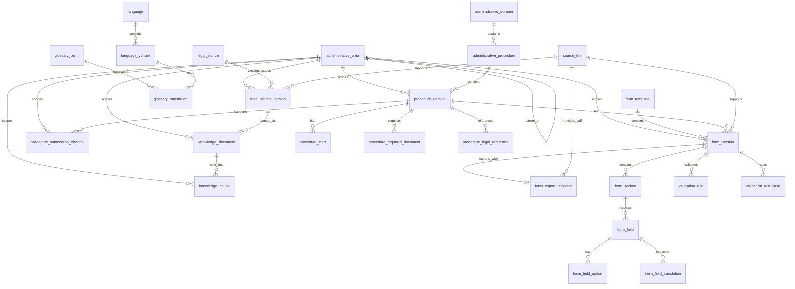

# ICIVI — Thiết kế Schema Version 1

## 1. Mục tiêu tài liệu

Tài liệu này mô tả schema dữ liệu cho ICIVI Version 1, tiếp nối:

- `00-overview.md`
- `01-architecture.md`

Phạm vi gồm:

1. Schema dữ liệu thủ tục hành chính.
2. Schema biểu mẫu và các trường cần điền.
3. Schema validation rules.
4. Schema dữ liệu RAG và nguồn tham chiếu.
5. Schema đa ngôn ngữ.
6. Schema state của LangGraph.
7. Schema session ngắn hạn trên Redis.
8. Cấu trúc lưu file trên filesystem của máy chủ LAN/internal.
9. Quy tắc versioning, review và publish dữ liệu.

Version 1 không có tài khoản người dùng và không lưu hồ sơ cá nhân lâu dài. Dữ liệu người dùng nhập trong phiên chat chỉ tồn tại tạm thời theo TTL của session.

Chi tiết REST API request/response sẽ được mô tả trong tài liệu API riêng.

---

## 2. Nguyên tắc thiết kế schema

### 2.1 Schema-driven

Biểu mẫu và quy tắc kiểm tra phải được cấu hình bằng dữ liệu, không viết cứng trong chatbot hoặc LangGraph.

Khi thêm một biểu mẫu mới, quy trình chính gồm:

1. Tạo thủ tục.
2. Tạo phiên bản thủ tục.
3. Tạo biểu mẫu.
4. Tạo phiên bản biểu mẫu.
5. Khai báo section và field.
6. Khai báo validation rules.
7. Gắn nguồn pháp lý.
8. Chạy test.
9. Review.
10. Publish.

### 2.2 Versioned data

Dữ liệu thủ tục và biểu mẫu có thể thay đổi theo văn bản hoặc hướng dẫn mới.

Không cập nhật đè một phiên bản đã publish. Khi thay đổi cần tạo version mới.

Một câu trả lời của chatbot phải truy vết được về:

- `procedure_version_id`
- `form_version_id`
- `legal_source_version_id`
- `knowledge_chunk_id`

### 2.3 Phân tách dữ liệu chuẩn hóa và dữ liệu linh hoạt

Dữ liệu cần truy vấn, join và versioning được lưu bằng cột quan hệ.

Dữ liệu cấu hình linh hoạt được lưu bằng `JSONB`, ví dụ:

- UI configuration.
- Validation parameters.
- Conditional visibility.
- Extraction hints.
- Format examples.
- Metadata nguồn.

### 2.4 Không lưu raw PII lâu dài

Theo mặc định, PostgreSQL không lưu:

- Nội dung đơn người dùng vừa nhập.
- CCCD của người dùng.
- Số điện thoại.
- Email.
- Địa chỉ đầy đủ.
- Toàn bộ nội dung hội thoại.

Những dữ liệu này chỉ tồn tại tạm thời trong Redis session, hết hạn sau 30 phút không hoạt động và phải được xóa ngay khi người dùng kết thúc session. Redis không persistence hoặc backup các key chứa PII.

### 2.5 LLM không sửa schema nguồn

LLM có thể:

- Trích xuất giá trị theo schema.
- Diễn giải field.
- Giải thích validation result.
- Chuyển ngôn ngữ.

LLM không được:

- Tự tạo field bắt buộc mới.
- Tự đổi severity của rule.
- Tự thay đổi phiên bản biểu mẫu.
- Tự publish dữ liệu.
- Tự sửa căn cứ pháp lý.

---

## 3. Phân vùng dữ liệu

Schema được chia thành sáu domain.

```text
1. Procedure Domain
   - thủ tục
   - phiên bản
   - bước thực hiện
   - hồ sơ cần chuẩn bị
   - kênh nộp
   - phạm vi địa bàn áp dụng

2. Form Domain
   - biểu mẫu
   - section
   - field
   - option
   - hướng dẫn điền
   - bản dịch
   - template PDF export

3. Validation Domain
   - field rule
   - cross-field rule
   - document rule
   - common error
   - test case

4. Knowledge Domain
   - văn bản nguồn
   - file nguồn
   - knowledge document
   - knowledge chunk
   - FAQ
   - citation

5. Language Domain
   - ngôn ngữ
   - biến thể ngôn ngữ
   - glossary
   - bản dịch

6. Runtime Domain
   - Redis session
   - LangGraph state
   - validation result tạm thời
   - request state
   - location context và consent LLM ngoài
```

---

## 4. Quy ước đặt tên

### 4.1 Database

- Tên bảng: `snake_case`, số ít.
- Primary key: `id`.
- Foreign key: `<entity>_id`.
- Mã nghiệp vụ: `<entity>_code`.
- Thời gian: `created_at`, `updated_at`.
- Hiệu lực: `effective_from`, `effective_to`.
- Trạng thái: `status`.
- Trường JSON linh hoạt: `metadata`, `config`, `parameters`.
- Tất cả timestamp dùng `TIMESTAMPTZ`.
- Ngày nghiệp vụ không cần giờ dùng `DATE`.

### 4.2 JSON

- Key dùng `snake_case`.
- Không dùng label tiếng Việt làm key.
- Key ổn định theo mã kỹ thuật, ví dụ:

```json
{
  "applicant_full_name": "Nguyễn Văn An"
}
```

Không dùng:

```json
{
  "Họ và tên người đề nghị": "Nguyễn Văn An"
}
```

### 4.3 Mã nghiệp vụ

Ví dụ:

```text
procedure_code: BIRTH_REGISTRATION
form_code: BIRTH_REGISTRATION_FORM
field_code: CHILD_BIRTH_DATE
rule_code: BIRTH_DATE_NOT_FUTURE
language_code: vi
```

Mã không thay đổi khi label hiển thị thay đổi.

---

## 5. Entity Relationship tổng quan



---

## 5.1 Jurisdiction model

Địa bàn là context theo session, không phải hồ sơ người dùng. Chatbot chỉ thu thập tỉnh hoặc thành phố khi câu trả lời phụ thuộc địa bàn; chỉ hỏi cấp thấp hơn khi dữ liệu đã publish yêu cầu. Không dùng địa chỉ đầy đủ để chọn nội dung.

Mọi nội dung có thể khác theo địa phương dùng hai trường sau:

```text
jurisdiction_scope:
- national
- province
- district

administrative_area_id:
- null khi jurisdiction_scope = national
- bắt buộc khi jurisdiction_scope = province hoặc district
```

## 5.2 `administrative_area`

Danh mục địa bàn có mã hành chính ổn định. Dữ liệu nguồn phải được versioned hoặc cập nhật khi mã hành chính thay đổi.

```sql
CREATE TABLE administrative_area (
    id UUID PRIMARY KEY,
    area_code TEXT NOT NULL UNIQUE,
    name_vi TEXT NOT NULL,
    area_level TEXT NOT NULL,
    parent_id UUID REFERENCES administrative_area(id),
    status TEXT NOT NULL DEFAULT 'active',
    effective_from DATE,
    effective_to DATE,
    created_at TIMESTAMPTZ NOT NULL DEFAULT now(),
    updated_at TIMESTAMPTZ NOT NULL DEFAULT now()
);
```

### `area_level`

```text
province
district
ward
```

MVP hỏi `province` trước. `district` hoặc `ward` chỉ được hỏi khi procedure hoặc nội dung đã publish có `jurisdiction_scope` tương ứng.

---

# 6. Procedure Domain

## 6.1 `administrative_domain`

Phân nhóm thủ tục.

Ví dụ:

- Hộ tịch.
- Xây dựng.
- Cư trú.
- Đất đai.
- Giáo dục.

```sql
CREATE TABLE administrative_domain (
    id UUID PRIMARY KEY,
    domain_code TEXT NOT NULL UNIQUE,
    name_vi TEXT NOT NULL,
    description TEXT,
    status TEXT NOT NULL DEFAULT 'active',
    created_at TIMESTAMPTZ NOT NULL DEFAULT now(),
    updated_at TIMESTAMPTZ NOT NULL DEFAULT now()
);
```

### Constraint

```text
status:
- active
- inactive
```

---

## 6.2 `administrative_procedure`

Định danh ổn định của một thủ tục.

Ví dụ:

```text
BIRTH_REGISTRATION
CONSTRUCTION_PERMIT
```

```sql
CREATE TABLE administrative_procedure (
    id UUID PRIMARY KEY,
    domain_id UUID NOT NULL REFERENCES administrative_domain(id),
    procedure_code TEXT NOT NULL UNIQUE,
    external_procedure_code TEXT,
    status TEXT NOT NULL DEFAULT 'active',
    created_at TIMESTAMPTZ NOT NULL DEFAULT now(),
    updated_at TIMESTAMPTZ NOT NULL DEFAULT now()
);
```

`external_procedure_code` dùng để lưu mã từ nguồn bên ngoài nếu có.

---

## 6.3 `procedure_version`

Lưu nội dung của một phiên bản thủ tục.

```sql
CREATE TABLE procedure_version (
    id UUID PRIMARY KEY,
    procedure_id UUID NOT NULL REFERENCES administrative_procedure(id),
    version_no INTEGER NOT NULL,
    title_vi TEXT NOT NULL,
    short_description_vi TEXT,
    target_users_vi TEXT,
    receiving_authority_vi TEXT,
    implementation_method_vi TEXT,
    processing_time_vi TEXT,
    fee_vi TEXT,
    result_vi TEXT,
    notes_vi TEXT,
    jurisdiction_scope TEXT NOT NULL DEFAULT 'national',
    administrative_area_id UUID REFERENCES administrative_area(id),
    effective_from DATE,
    effective_to DATE,
    status TEXT NOT NULL DEFAULT 'draft',
    source_updated_at TIMESTAMPTZ,
    metadata JSONB NOT NULL DEFAULT '{}',
    created_at TIMESTAMPTZ NOT NULL DEFAULT now(),
    updated_at TIMESTAMPTZ NOT NULL DEFAULT now(),
    UNIQUE (procedure_id, version_no)
);
```

`jurisdiction_scope` dùng `national`, `province` hoặc `district`. `administrative_area_id` phải null cho `national` và bắt buộc cho các scope còn lại.

### Trạng thái

```text
draft
in_review
published
archived
rejected
```

### Quy tắc

- Chỉ `published` được chatbot sử dụng.
- Một ngày chỉ nên có tối đa một version active cho một thủ tục.
- `effective_to` có thể null khi chưa có ngày hết hiệu lực.
- Version đã publish không được sửa nội dung nghiệp vụ trực tiếp.

---

## 6.4 `procedure_step`

Các bước thực hiện thủ tục.

```sql
CREATE TABLE procedure_step (
    id UUID PRIMARY KEY,
    procedure_version_id UUID NOT NULL
        REFERENCES procedure_version(id) ON DELETE CASCADE,
    step_no INTEGER NOT NULL,
    title_vi TEXT NOT NULL,
    description_vi TEXT NOT NULL,
    actor_type TEXT,
    estimated_duration_vi TEXT,
    metadata JSONB NOT NULL DEFAULT '{}',
    UNIQUE (procedure_version_id, step_no)
);
```

### `actor_type`

```text
citizen
receiving_authority
processing_authority
other
```

---

## 6.5 `procedure_required_document`

Danh sách thành phần hồ sơ cần chuẩn bị.

```sql
CREATE TABLE procedure_required_document (
    id UUID PRIMARY KEY,
    procedure_version_id UUID NOT NULL
        REFERENCES procedure_version(id) ON DELETE CASCADE,
    document_code TEXT NOT NULL,
    name_vi TEXT NOT NULL,
    description_vi TEXT,
    required BOOLEAN NOT NULL DEFAULT true,
    quantity_original INTEGER,
    quantity_copy INTEGER,
    accepted_formats JSONB NOT NULL DEFAULT '[]',
    condition_expression JSONB,
    display_order INTEGER NOT NULL DEFAULT 0,
    metadata JSONB NOT NULL DEFAULT '{}',
    UNIQUE (procedure_version_id, document_code)
);
```

Ví dụ `accepted_formats`:

```json
[
  "original",
  "certified_copy",
  "electronic_copy"
]
```

Ví dụ `condition_expression`:

```json
{
  "all": [
    {
      "field": "submission_by_authorized_person",
      "operator": "eq",
      "value": true
    }
  ]
}
```

---

## 6.6 `procedure_submission_channel`

Các phương thức thực hiện.

```sql
CREATE TABLE procedure_submission_channel (
    id UUID PRIMARY KEY,
    procedure_version_id UUID NOT NULL
        REFERENCES procedure_version(id) ON DELETE CASCADE,
    channel_type TEXT NOT NULL,
    jurisdiction_scope TEXT NOT NULL DEFAULT 'national',
    administrative_area_id UUID REFERENCES administrative_area(id),
    location_vi TEXT,
    url TEXT,
    working_time_vi TEXT,
    instructions_vi TEXT,
    display_order INTEGER NOT NULL DEFAULT 0
);
```

### `channel_type`

```text
in_person
online
postal
other
```

---

## 6.7 `procedure_legal_reference`

Liên kết thủ tục với nguồn pháp lý.

```sql
CREATE TABLE procedure_legal_reference (
    id UUID PRIMARY KEY,
    procedure_version_id UUID NOT NULL
        REFERENCES procedure_version(id) ON DELETE CASCADE,
    legal_source_version_id UUID NOT NULL,
    reference_type TEXT NOT NULL,
    section_reference TEXT,
    note_vi TEXT,
    display_order INTEGER NOT NULL DEFAULT 0,
    UNIQUE (
        procedure_version_id,
        legal_source_version_id,
        reference_type,
        section_reference
    )
);
```

### `reference_type`

```text
legal_basis
required_document
processing_time
fee
authority
form_template
other
```

Foreign key tới `legal_source_version` được tạo sau khi bảng đó tồn tại.

---

# 7. Form Domain

## 7.1 `form_template`

Định danh ổn định của biểu mẫu.

```sql
CREATE TABLE form_template (
    id UUID PRIMARY KEY,
    form_code TEXT NOT NULL UNIQUE,
    name_vi TEXT NOT NULL,
    status TEXT NOT NULL DEFAULT 'active',
    created_at TIMESTAMPTZ NOT NULL DEFAULT now(),
    updated_at TIMESTAMPTZ NOT NULL DEFAULT now()
);
```

Ví dụ:

```text
BIRTH_REGISTRATION_FORM
CONSTRUCTION_PERMIT_REQUEST_FORM
```

---

## 7.2 `form_version`

Phiên bản cụ thể của biểu mẫu.

```sql
CREATE TABLE form_version (
    id UUID PRIMARY KEY,
    form_template_id UUID NOT NULL REFERENCES form_template(id),
    procedure_version_id UUID NOT NULL REFERENCES procedure_version(id),
    version_no INTEGER NOT NULL,
    title_vi TEXT NOT NULL,
    description_vi TEXT,
    original_file_id UUID,
    json_schema JSONB NOT NULL,
    ui_schema JSONB NOT NULL DEFAULT '{}',
    extraction_schema JSONB NOT NULL DEFAULT '{}',
    jurisdiction_scope TEXT NOT NULL DEFAULT 'national',
    administrative_area_id UUID REFERENCES administrative_area(id),
    effective_from DATE,
    effective_to DATE,
    status TEXT NOT NULL DEFAULT 'draft',
    created_at TIMESTAMPTZ NOT NULL DEFAULT now(),
    updated_at TIMESTAMPTZ NOT NULL DEFAULT now(),
    UNIQUE (form_template_id, version_no)
);
```

### Vai trò của các cột JSON

- `json_schema`: cấu trúc dữ liệu chuẩn để validate.
- `ui_schema`: cách nhóm và hiển thị trên frontend.
- `extraction_schema`: hướng dẫn chuẩn hóa dữ liệu từ câu chat.
- Các bảng `form_section`, `form_field` vẫn là nguồn cấu hình chi tiết và dễ truy vấn.
- `json_schema` có thể được generate từ các bảng field hoặc được lưu như artifact đã compile.

---

## 7.3 `form_export_template`

Template export chỉ áp dụng cho form đã có PDF nền và mapping được review.
V1 chỉ publish template cho `BIRTH_REGISTRATION_FORM` và
`CONSTRUCTION_PERMIT_REQUEST_FORM`.

```sql
CREATE TABLE form_export_template (
    id UUID PRIMARY KEY,
    form_version_id UUID NOT NULL UNIQUE
        REFERENCES form_version(id) ON DELETE CASCADE,
    pdf_template_file_id UUID NOT NULL REFERENCES source_file(id),
    mapping JSONB NOT NULL,
    renderer_version TEXT NOT NULL,
    status TEXT NOT NULL DEFAULT 'draft',
    reviewed_by TEXT,
    reviewed_at TIMESTAMPTZ,
    published_at TIMESTAMPTZ,
    created_at TIMESTAMPTZ NOT NULL DEFAULT now(),
    updated_at TIMESTAMPTZ NOT NULL DEFAULT now()
);
```

`pdf_template_file_id` là PDF nền dẫn xuất từ `.doc` gốc bằng LibreOffice.
File gốc, PDF nền và mapping phải có checksum, review trực quan và version rõ
ràng trước khi template được publish.

### Mapping field

Mỗi entry mapping có tối thiểu `field_code`, `page`, `x`, `y`, `width`,
`height`, `font_family`, `font_size`, `align`, `format` và `overflow_policy`.
V1 dùng font Noto Sans để render tiếng Việt.

```json
{
  "field_code": "applicant_full_name",
  "page": 1,
  "x": 72,
  "y": 654,
  "width": 210,
  "height": 16,
  "font_family": "Noto Sans",
  "font_size": 10,
  "align": "left",
  "format": "text",
  "overflow_policy": "reject"
}
```

`overflow_policy` chỉ cho phép `reject` trong V1. Render text vượt vùng hoặc
không render được là lỗi export; backend không cắt ngầm hoặc tự giảm cỡ chữ.

### Trạng thái

```text
draft
in_review
published
archived
```

---

## 7.4 `form_section`

Nhóm các field theo bố cục biểu mẫu.

```sql
CREATE TABLE form_section (
    id UUID PRIMARY KEY,
    form_version_id UUID NOT NULL
        REFERENCES form_version(id) ON DELETE CASCADE,
    section_code TEXT NOT NULL,
    title_vi TEXT NOT NULL,
    description_vi TEXT,
    display_order INTEGER NOT NULL,
    visibility_expression JSONB,
    ui_config JSONB NOT NULL DEFAULT '{}',
    UNIQUE (form_version_id, section_code)
);
```

Ví dụ:

```text
APPLICANT_INFORMATION
CHILD_INFORMATION
CONSTRUCTION_PROJECT_INFORMATION
ATTACHED_DOCUMENTS
```

---

## 7.5 `form_field`

Định nghĩa một trường trong biểu mẫu.

```sql
CREATE TABLE form_field (
    id UUID PRIMARY KEY,
    form_version_id UUID NOT NULL
        REFERENCES form_version(id) ON DELETE CASCADE,
    section_id UUID REFERENCES form_section(id) ON DELETE SET NULL,
    field_code TEXT NOT NULL,
    label_vi TEXT NOT NULL,
    help_text_vi TEXT,
    instruction_vi TEXT,
    example_vi TEXT,
    data_type TEXT NOT NULL,
    required BOOLEAN NOT NULL DEFAULT false,
    sensitive_level TEXT NOT NULL DEFAULT 'normal',
    display_order INTEGER NOT NULL DEFAULT 0,
    default_value JSONB,
    field_config JSONB NOT NULL DEFAULT '{}',
    visibility_expression JSONB,
    requirement_expression JSONB,
    source_document_hint_vi TEXT,
    created_at TIMESTAMPTZ NOT NULL DEFAULT now(),
    updated_at TIMESTAMPTZ NOT NULL DEFAULT now(),
    UNIQUE (form_version_id, field_code)
);
```

### `data_type`

```text
string
text
integer
decimal
boolean
date
datetime
enum
multi_enum
object
array
address
phone
email
citizen_id
file_reference
```

### `sensitive_level`

```text
public
normal
personal
sensitive
highly_sensitive
```

Ví dụ:

- Tên biểu mẫu: `public`
- Họ tên: `personal`
- Địa chỉ: `sensitive`
- Số định danh: `highly_sensitive`

### Ví dụ `field_config`

```json
{
  "min_length": 1,
  "max_length": 100,
  "trim": true,
  "normalize_whitespace": true,
  "input_component": "text",
  "autocomplete": "off"
}
```

Ví dụ field địa chỉ:

```json
{
  "input_component": "address",
  "properties": [
    "province_code",
    "ward_code",
    "address_line"
  ]
}
```

---

## 7.6 `form_field_option`

Lựa chọn cho field dạng enum.

```sql
CREATE TABLE form_field_option (
    id UUID PRIMARY KEY,
    form_field_id UUID NOT NULL
        REFERENCES form_field(id) ON DELETE CASCADE,
    option_code TEXT NOT NULL,
    label_vi TEXT NOT NULL,
    value JSONB NOT NULL,
    display_order INTEGER NOT NULL DEFAULT 0,
    status TEXT NOT NULL DEFAULT 'active',
    UNIQUE (form_field_id, option_code)
);
```

Ví dụ:

```json
{
  "option_code": "FATHER",
  "label_vi": "Cha",
  "value": "father"
}
```

---

## 7.7 `form_field_translation`

Bản dịch của field.

```sql
CREATE TABLE form_field_translation (
    id UUID PRIMARY KEY,
    form_field_id UUID NOT NULL
        REFERENCES form_field(id) ON DELETE CASCADE,
    language_variant_id UUID NOT NULL,
    label TEXT NOT NULL,
    help_text TEXT,
    instruction TEXT,
    example TEXT,
    review_status TEXT NOT NULL DEFAULT 'draft',
    reviewed_by TEXT,
    reviewed_at TIMESTAMPTZ,
    UNIQUE (form_field_id, language_variant_id)
);
```

V1 không bắt buộc có reviewer account. `reviewed_by` có thể là tên hoặc mã nội bộ của người kiểm duyệt dữ liệu.

---

# 8. JSON Schema cho biểu mẫu

## 8.1 Schema tổng quát

Ví dụ rút gọn:

```json
{
  "$schema": "https://json-schema.org/draft/2020-12/schema",
  "$id": "icivi://forms/BIRTH_REGISTRATION_FORM/v1",
  "title": "Tờ khai đăng ký khai sinh",
  "type": "object",
  "additionalProperties": false,
  "properties": {
    "applicant_full_name": {
      "type": "string",
      "minLength": 1,
      "maxLength": 100
    },
    "child_birth_date": {
      "type": "string",
      "format": "date"
    },
    "child_sex": {
      "type": "string",
      "enum": ["male", "female", "other"]
    }
  },
  "required": [
    "applicant_full_name",
    "child_birth_date"
  ]
}
```

### Nguyên tắc

- `additionalProperties` mặc định là `false`.
- Dùng `field_code` làm property key.
- Không chứa nội dung pháp lý dài trong JSON Schema.
- Các rule nghiệp vụ phức tạp không nên ép vào JSON Schema; dùng Validation Rule DSL.
- Backend là nguồn validation cuối cùng.

---

## 8.2 UI Schema

Ví dụ:

```json
{
  "layout": "sections",
  "sections": [
    {
      "section_code": "APPLICANT_INFORMATION",
      "title": "Thông tin người yêu cầu",
      "fields": [
        "applicant_full_name",
        "applicant_relationship"
      ]
    },
    {
      "section_code": "CHILD_INFORMATION",
      "title": "Thông tin người được đăng ký khai sinh",
      "fields": [
        "child_full_name",
        "child_birth_date",
        "child_sex"
      ]
    }
  ],
  "field_ui": {
    "child_birth_date": {
      "component": "date_picker"
    },
    "child_sex": {
      "component": "radio"
    }
  }
}
```

---

## 8.3 Extraction Schema

Hướng dẫn LLM hoặc extraction service đưa dữ liệu hội thoại về field chuẩn.

```json
{
  "fields": {
    "child_birth_date": {
      "description": "Ngày sinh của trẻ",
      "type": "date",
      "accepted_phrases": [
        "sinh ngày",
        "ngày sinh của cháu",
        "bé sinh"
      ],
      "normalization": "iso_date",
      "do_not_infer": true
    }
  }
}
```

`do_not_infer: true` có nghĩa là không được tự đoán giá trị khi người dùng chưa nói rõ.

---

# 9. Validation Domain

## 9.1 `validation_rule`

Lưu mọi rule kiểm tra của một phiên bản biểu mẫu.

```sql
CREATE TABLE validation_rule (
    id UUID PRIMARY KEY,
    form_version_id UUID NOT NULL
        REFERENCES form_version(id) ON DELETE CASCADE,
    rule_code TEXT NOT NULL,
    rule_type TEXT NOT NULL,
    target_field_code TEXT,
    severity TEXT NOT NULL,
    execution_order INTEGER NOT NULL DEFAULT 0,
    condition_expression JSONB,
    parameters JSONB NOT NULL DEFAULT '{}',
    message_key TEXT NOT NULL,
    message_vi TEXT NOT NULL,
    suggestion_vi TEXT,
    legal_source_version_id UUID,
    legal_section_reference TEXT,
    enabled BOOLEAN NOT NULL DEFAULT true,
    created_at TIMESTAMPTZ NOT NULL DEFAULT now(),
    updated_at TIMESTAMPTZ NOT NULL DEFAULT now(),
    UNIQUE (form_version_id, rule_code)
);
```

### `severity`

```text
blocking_error
warning
suggestion
unable_to_verify
```

### `rule_type`

```text
required
type
regex
min_length
max_length
min_value
max_value
date_not_future
date_not_past
date_before
date_after
enum
reference_lookup
conditional_required
cross_field
document_required
custom_function
```

---

## 9.2 Rule schema chuẩn

```json
{
  "rule_code": "CITIZEN_ID_FORMAT",
  "rule_type": "regex",
  "target_field_code": "applicant_citizen_id",
  "severity": "blocking_error",
  "execution_order": 10,
  "condition_expression": null,
  "parameters": {
    "pattern": "^[0-9]{12}$"
  },
  "message_key": "validation.citizen_id_format",
  "message_vi": "Số định danh cá nhân phải có đúng 12 chữ số.",
  "suggestion_vi": "Kiểm tra lại số định danh trên CCCD hoặc giấy tờ định danh.",
  "enabled": true
}
```

---

## 9.3 Condition Expression DSL

DSL dùng để mô tả điều kiện mà không thực thi code tùy ý.

### Cấu trúc logic

```json
{
  "all": [
    {
      "field": "submission_by_authorized_person",
      "operator": "eq",
      "value": true
    },
    {
      "field": "authorization_document_available",
      "operator": "eq",
      "value": false
    }
  ]
}
```

### Các toán tử hỗ trợ V1

```text
eq
ne
gt
gte
lt
lte
in
not_in
contains
not_contains
is_empty
is_not_empty
matches
before
after
```

### Nhóm logic

```text
all
any
not
```

### Quy tắc an toàn

- Không cho phép biểu thức Python hoặc JavaScript.
- Không dùng `eval`.
- Field phải thuộc allowlist của form version.
- Regex phải giới hạn độ dài.
- Giới hạn độ sâu expression.
- Giới hạn số node trong expression.

---

## 9.4 Cross-field rule

Ví dụ ngày dự kiến hoàn thành phải sau ngày khởi công:

```json
{
  "rule_code": "CONSTRUCTION_END_AFTER_START",
  "rule_type": "cross_field",
  "severity": "blocking_error",
  "parameters": {
    "left_field": "expected_completion_date",
    "operator": "after",
    "right_field": "expected_start_date"
  },
  "message_vi": "Ngày dự kiến hoàn thành phải sau ngày dự kiến khởi công."
}
```

---

## 9.5 Conditional required rule

Ví dụ có ủy quyền thì cần thông tin người được ủy quyền:

```json
{
  "rule_code": "AUTHORIZED_PERSON_REQUIRED",
  "rule_type": "conditional_required",
  "target_field_code": "authorized_person",
  "severity": "blocking_error",
  "condition_expression": {
    "all": [
      {
        "field": "submission_by_authorized_person",
        "operator": "eq",
        "value": true
      }
    ]
  },
  "parameters": {},
  "message_vi": "Bạn cần nhập thông tin người được ủy quyền."
}
```

---

## 9.6 Document required rule

```json
{
  "rule_code": "AUTHORIZATION_DOCUMENT_REQUIRED",
  "rule_type": "document_required",
  "target_field_code": "authorization_document",
  "severity": "blocking_error",
  "condition_expression": {
    "all": [
      {
        "field": "submission_by_authorized_person",
        "operator": "eq",
        "value": true
      }
    ]
  },
  "parameters": {
    "document_code": "AUTHORIZATION_DOCUMENT"
  },
  "message_vi": "Trường hợp nộp thay cần chuẩn bị giấy ủy quyền hoặc giấy tờ chứng minh quyền đại diện."
}
```

---

## 9.7 `common_error`

Các lỗi phổ biến dùng cho chatbot hướng dẫn.

```sql
CREATE TABLE common_error (
    id UUID PRIMARY KEY,
    form_version_id UUID NOT NULL
        REFERENCES form_version(id) ON DELETE CASCADE,
    error_code TEXT NOT NULL,
    title_vi TEXT NOT NULL,
    description_vi TEXT NOT NULL,
    affected_field_codes JSONB NOT NULL DEFAULT '[]',
    example_wrong_vi TEXT,
    example_correct_vi TEXT,
    severity TEXT NOT NULL DEFAULT 'warning',
    display_order INTEGER NOT NULL DEFAULT 0,
    UNIQUE (form_version_id, error_code)
);
```

---

## 9.8 `validation_test_case`

Mỗi rule hoặc nhóm rule cần có test case.

```sql
CREATE TABLE validation_test_case (
    id UUID PRIMARY KEY,
    form_version_id UUID NOT NULL
        REFERENCES form_version(id) ON DELETE CASCADE,
    test_code TEXT NOT NULL,
    title TEXT NOT NULL,
    input_data JSONB NOT NULL,
    expected_status TEXT NOT NULL,
    expected_issue_codes JSONB NOT NULL DEFAULT '[]',
    unexpected_issue_codes JSONB NOT NULL DEFAULT '[]',
    enabled BOOLEAN NOT NULL DEFAULT true,
    UNIQUE (form_version_id, test_code)
);
```

Ví dụ:

```json
{
  "test_code": "BIRTH_DATE_IN_FUTURE",
  "input_data": {
    "child_birth_date": "2099-01-01"
  },
  "expected_status": "invalid",
  "expected_issue_codes": [
    "CHILD_BIRTH_DATE_NOT_FUTURE"
  ],
  "unexpected_issue_codes": []
}
```

---

# 10. Validation Result Schema

## 10.1 Kết quả tổng quát

```json
{
  "validation_id": "uuid",
  "form_code": "BIRTH_REGISTRATION_FORM",
  "form_version": 1,
  "input_hash": "sha256:...",
  "status": "invalid",
  "summary": {
    "blocking_error": 2,
    "warning": 1,
    "suggestion": 0,
    "unable_to_verify": 0
  },
  "issues": [
    {
      "issue_code": "FIELD_REQUIRED",
      "rule_code": "CHILD_BIRTH_DATE_REQUIRED",
      "field_code": "child_birth_date",
      "severity": "blocking_error",
      "message": "Bạn chưa nhập ngày sinh của trẻ.",
      "suggestion": "Nhập ngày sinh theo giấy chứng sinh hoặc giấy tờ nguồn.",
      "source": {
        "type": "validation_rule",
        "rule_id": "uuid",
        "legal_source_version_id": null,
        "section_reference": null
      }
    }
  ],
  "validated_at": "2026-07-17T21:00:00+07:00"
}
```

`input_hash` là SHA-256 của form input đã normalize. Khi export, backend hash
lại input hiện tại trong session và từ chối nếu không khớp validation result.
Điều này buộc người dùng chạy validation lại sau mỗi lần sửa form.

## 10.2 `status`

```text
valid
valid_with_warnings
invalid
unable_to_validate
```

### Quy tắc tính

- Có ít nhất một `blocking_error` → `invalid`.
- Không có blocking error nhưng có warning → `valid_with_warnings`.
- Không có issue → `valid`.
- Không load được schema hoặc thiếu version → `unable_to_validate`.

---

# 11. Knowledge Domain

## 11.1 `source_file`

Metadata file nằm trên local filesystem.

```sql
CREATE TABLE source_file (
    id UUID PRIMARY KEY,
    file_code TEXT NOT NULL UNIQUE,
    original_name TEXT NOT NULL,
    storage_path TEXT NOT NULL,
    mime_type TEXT NOT NULL,
    size_bytes BIGINT,
    sha256 TEXT NOT NULL,
    source_url TEXT,
    source_name TEXT,
    downloaded_at TIMESTAMPTZ,
    derived_from_file_id UUID REFERENCES source_file(id),
    file_status TEXT NOT NULL DEFAULT 'active',
    metadata JSONB NOT NULL DEFAULT '{}',
    created_at TIMESTAMPTZ NOT NULL DEFAULT now()
);
```

### Không lưu

- File bytes trong PostgreSQL.
- Base64 file trong JSONB.

### `storage_path`

Dùng đường dẫn tương đối:

```text
documents/legal/2026/luat-ho-tich.pdf
```

Không lưu absolute path phụ thuộc máy:

```text
/home/user/project/data/...
```

PDF nền export được lưu cùng form version, ví dụ:

```text
documents/forms/birth_registration/v1/export_template.pdf
```

PDF người dùng đã điền không phải `source_file`: backend tạo trong memory và
stream trực tiếp để tránh lưu PII.

---

## 11.2 `legal_source`

Định danh ổn định của văn bản.

```sql
CREATE TABLE legal_source (
    id UUID PRIMARY KEY,
    source_code TEXT NOT NULL UNIQUE,
    source_type TEXT NOT NULL,
    issuing_authority_vi TEXT,
    document_number TEXT,
    title_vi TEXT NOT NULL,
    status TEXT NOT NULL DEFAULT 'active',
    created_at TIMESTAMPTZ NOT NULL DEFAULT now(),
    updated_at TIMESTAMPTZ NOT NULL DEFAULT now()
);
```

### `source_type`

```text
law
decree
circular
decision
resolution
official_letter
procedure_guide
form_instruction
faq
other
```

---

## 11.3 `legal_source_version`

```sql
CREATE TABLE legal_source_version (
    id UUID PRIMARY KEY,
    legal_source_id UUID NOT NULL REFERENCES legal_source(id),
    version_no INTEGER NOT NULL,
    source_file_id UUID REFERENCES source_file(id),
    jurisdiction_scope TEXT NOT NULL DEFAULT 'national',
    administrative_area_id UUID REFERENCES administrative_area(id),
    issued_date DATE,
    effective_from DATE,
    effective_to DATE,
    status TEXT NOT NULL DEFAULT 'draft',
    source_url TEXT,
    extracted_text_path TEXT,
    metadata JSONB NOT NULL DEFAULT '{}',
    created_at TIMESTAMPTZ NOT NULL DEFAULT now(),
    UNIQUE (legal_source_id, version_no)
);
```

---

## 11.4 `knowledge_document`

Tài liệu đã chuẩn hóa dùng cho RAG.

```sql
CREATE TABLE knowledge_document (
    id UUID PRIMARY KEY,
    document_code TEXT NOT NULL UNIQUE,
    legal_source_version_id UUID REFERENCES legal_source_version(id),
    procedure_version_id UUID REFERENCES procedure_version(id),
    jurisdiction_scope TEXT NOT NULL DEFAULT 'national',
    administrative_area_id UUID REFERENCES administrative_area(id),
    document_type TEXT NOT NULL,
    language_code TEXT NOT NULL DEFAULT 'vi',
    title TEXT NOT NULL,
    normalized_text_path TEXT,
    status TEXT NOT NULL DEFAULT 'draft',
    metadata JSONB NOT NULL DEFAULT '{}',
    created_at TIMESTAMPTZ NOT NULL DEFAULT now(),
    updated_at TIMESTAMPTZ NOT NULL DEFAULT now()
);
```

---

## 11.5 `knowledge_chunk`

```sql
CREATE TABLE knowledge_chunk (
    id UUID PRIMARY KEY,
    knowledge_document_id UUID NOT NULL
        REFERENCES knowledge_document(id) ON DELETE CASCADE,
    chunk_no INTEGER NOT NULL,
    chunk_type TEXT NOT NULL,
    hierarchy_path JSONB NOT NULL DEFAULT '[]',
    title TEXT,
    content TEXT NOT NULL,
    token_count INTEGER,
    text_search TSVECTOR,
    embedding VECTOR,
    jurisdiction_scope TEXT NOT NULL DEFAULT 'national',
    administrative_area_id UUID REFERENCES administrative_area(id),
    metadata JSONB NOT NULL DEFAULT '{}',
    created_at TIMESTAMPTZ NOT NULL DEFAULT now(),
    UNIQUE (knowledge_document_id, chunk_no)
);
```

### `chunk_type`

```text
chapter
article
clause
point
procedure_section
form_instruction
faq
other
```

### Ví dụ `hierarchy_path`

```json
[
  {
    "level": "chapter",
    "label": "Chương II"
  },
  {
    "level": "article",
    "label": "Điều 16"
  },
  {
    "level": "clause",
    "label": "Khoản 1"
  }
]
```

### Lưu ý vector dimension

Cột `embedding` chỉ định dimension khi đã chốt embedding model.

Ví dụ nếu model có dimension 1024:

```sql
embedding VECTOR(1024)
```

Không copy dimension giữa các model mà không kiểm tra.

---

## 11.6 `faq`

```sql
CREATE TABLE faq (
    id UUID PRIMARY KEY,
    procedure_version_id UUID REFERENCES procedure_version(id),
    form_version_id UUID REFERENCES form_version(id),
    jurisdiction_scope TEXT NOT NULL DEFAULT 'national',
    administrative_area_id UUID REFERENCES administrative_area(id),
    language_code TEXT NOT NULL DEFAULT 'vi',
    question TEXT NOT NULL,
    answer TEXT NOT NULL,
    status TEXT NOT NULL DEFAULT 'draft',
    legal_references JSONB NOT NULL DEFAULT '[]',
    tags JSONB NOT NULL DEFAULT '[]',
    display_order INTEGER NOT NULL DEFAULT 0,
    created_at TIMESTAMPTZ NOT NULL DEFAULT now()
);
```

FAQ chỉ được retrieval khi `status = 'published'`.

---

# 12. Citation Schema

Citation trả cho chatbot:

```json
{
  "citation_id": "CIT-001",
  "knowledge_chunk_id": "uuid",
  "source_code": "LAW_CIVIL_STATUS_2014",
  "source_title": "Luật Hộ tịch",
  "document_number": "60/2014/QH13",
  "section_reference": "Điều 16",
  "source_url": "https://...",
  "effective_from": "2016-01-01",
  "jurisdiction_scope": "national",
  "administrative_area_code": null,
  "quote_preview": "..."
}
```

### Quy tắc

- `citation_id` chỉ có giá trị trong một response hoặc request context.
- `knowledge_chunk_id` là khóa truy vết chính.
- `quote_preview` phải ngắn.
- Không để LLM tự tạo `document_number`.
- Citation chỉ lấy từ metadata retrieval.
- Citation phải hiển thị phạm vi áp dụng và mã địa bàn khi không phải `national`.

---

# 13. Language Domain

## 13.1 `language`

```sql
CREATE TABLE language (
    id UUID PRIMARY KEY,
    language_code TEXT NOT NULL UNIQUE,
    name_vi TEXT NOT NULL,
    native_name TEXT,
    status TEXT NOT NULL DEFAULT 'active'
);
```

Ví dụ:

```text
vi
```

Không dùng một mã ngôn ngữ chung chung cho một nhóm phương ngữ nếu chưa xác định đúng biến thể — ví dụ hệ thống dùng `mww` (Hmong Daw) chứ không phải mã Hmong chung chung, và `km` (Khmer) chứ không phải mã gộp Khmer/Môn-Khmer.

---

## 13.2 `language_variant`

```sql
CREATE TABLE language_variant (
    id UUID PRIMARY KEY,
    language_id UUID NOT NULL REFERENCES language(id),
    variant_code TEXT NOT NULL UNIQUE,
    name_vi TEXT NOT NULL,
    native_name TEXT,
    region_vi TEXT,
    script_code TEXT,
    status TEXT NOT NULL DEFAULT 'pilot',
    metadata JSONB NOT NULL DEFAULT '{}'
);
```

Ví dụ mã nội bộ:

```text
tai_dam
tai_don
tai_daeng
```

Mã thực tế phải được xác nhận với chuyên gia ngôn ngữ trước khi production.

---

## 13.3 `glossary_term`

```sql
CREATE TABLE glossary_term (
    id UUID PRIMARY KEY,
    term_code TEXT NOT NULL UNIQUE,
    term_vi TEXT NOT NULL,
    definition_vi TEXT,
    domain_id UUID REFERENCES administrative_domain(id),
    keep_original_in_citation BOOLEAN NOT NULL DEFAULT true,
    status TEXT NOT NULL DEFAULT 'active'
);
```

---

## 13.4 `glossary_translation`

```sql
CREATE TABLE glossary_translation (
    id UUID PRIMARY KEY,
    glossary_term_id UUID NOT NULL
        REFERENCES glossary_term(id) ON DELETE CASCADE,
    language_variant_id UUID NOT NULL
        REFERENCES language_variant(id),
    translated_term TEXT NOT NULL,
    translated_definition TEXT,
    usage_note TEXT,
    review_status TEXT NOT NULL DEFAULT 'draft',
    reviewed_by TEXT,
    reviewed_at TIMESTAMPTZ,
    UNIQUE (glossary_term_id, language_variant_id)
);
```

---

# 14. Runtime Schema — Redis

Version 1 dùng Redis cho dữ liệu tạm, không dùng PostgreSQL làm kho lịch sử hội thoại.

## 14.1 Session key

```text
icivi:v1:session:{session_id}
```

Kiểu Redis:

```text
HASH hoặc JSON
```

TTL bắt buộc:

```text
30 phút không hoạt động
```

Giá trị:

```json
{
  "session_id": "uuid",
  "language_code": "vi",
  "language_variant_code": null,
  "administrative_area_code": null,
  "administrative_area_level": null,
  "external_llm_consent": false,
  "external_llm_consent_at": null,
  "current_intent": "form_validation",
  "procedure_code": "BIRTH_REGISTRATION",
  "procedure_version": 1,
  "form_code": "BIRTH_REGISTRATION_FORM",
  "form_version": 1,
  "created_at": "2026-07-17T20:00:00+07:00",
  "last_activity_at": "2026-07-17T20:05:00+07:00",
  "expires_at": "2026-07-17T21:05:00+07:00"
}
```

---

## 14.2 Graph state key

```text
icivi:v1:graph:{session_id}
```

Giá trị rút gọn:

```json
{
  "messages": [
    {
      "role": "user",
      "content": "Tôi muốn đăng ký khai sinh cho con"
    }
  ],
  "collected_slots": {},
  "pending_question": null,
  "citations": [],
  "last_node": "classify_intent",
  "error": null
}
```

Giới hạn số message được lưu. Có thể chỉ giữ:

- N message gần nhất.
- Conversation summary.
- Slot state.

Không lưu vô hạn toàn bộ lịch sử.

`administrative_area_code` chỉ lưu mã địa bàn người dùng đã chọn, không lưu địa chỉ đầy đủ. Người dùng có thể thay đổi giá trị này trong session.

`external_llm_consent` chỉ là trạng thái runtime để chặn gọi provider ngoài khi chưa có consent; không lưu consent như hồ sơ người dùng lâu dài.

---

## 14.3 Temporary form input key

```text
icivi:v1:form_input:{session_id}:{form_code}
```

```json
{
  "form_version": 1,
  "data": {
    "applicant_full_name": "..."
  },
  "updated_at": "..."
}
```

TTL phải bằng hoặc ngắn hơn session TTL.

---

## 14.4 Validation result key

```text
icivi:v1:validation:{session_id}:{validation_id}
```

Dùng để người dùng sửa và kiểm tra lại trong cùng phiên.

Giá trị phải gồm `form_code`, `form_version`, `input_hash`, summary severity và
issues. Export chỉ dùng validation result có `blocking_error = 0`.

---

## 14.5 Rate limit key

```text
icivi:v1:rate:session:{session_id}:{window}
icivi:v1:rate:ip:{ip_hash}:{window}
```

Không lưu raw IP nếu không cần.

---

## 14.6 Request streaming key

```text
icivi:v1:request:{request_id}
```

```json
{
  "session_id": "uuid",
  "status": "streaming",
  "started_at": "...",
  "cancelled": false
}
```

### `status`

```text
queued
processing
streaming
completed
failed
cancelled
```

---

# 15. LangGraph State Schema

Schema Python tương đương:

```python
from typing import Any, Literal, TypedDict

class ChatMessage(TypedDict):
    role: Literal["system", "user", "assistant", "tool"]
    content: str

class ICIVIState(TypedDict, total=False):
    session_id: str
    request_id: str

    language_code: str
    language_variant_code: str | None
    administrative_area_code: str | None
    administrative_area_level: str | None
    external_llm_consent: bool

    messages: list[ChatMessage]
    conversation_summary: str | None

    current_intent: str | None
    procedure_code: str | None
    procedure_version: int | None
    form_code: str | None
    form_version: int | None

    collected_slots: dict[str, Any]
    missing_slots: list[str]
    pending_question: dict[str, Any] | None

    form_input: dict[str, Any] | None
    validation_result: dict[str, Any] | None

    retrieval_query: str | None
    retrieved_chunk_ids: list[str]
    citations: list[dict[str, Any]]

    response_payload: dict[str, Any] | None
    last_node: str | None
    error: dict[str, Any] | None
```

### Không lưu trong graph state

- File binary.
- Embedding vector.
- Full legal corpus.
- Database credentials.
- Encryption private key.
- Raw access token.
- Log toàn bộ dữ liệu nhạy cảm.

---

# 16. Local Filesystem Schema

## 16.1 Cấu trúc thư mục

```text
data/
├── postgres/
├── redis/
├── documents/
│   ├── legal/
│   │   ├── raw/
│   │   ├── normalized/
│   │   └── archived/
│   ├── procedures/
│   │   ├── raw/
│   │   ├── normalized/
│   │   └── archived/
│   ├── forms/
│   │   ├── birth_registration/
│   │   └── construction_permit/
│   └── faq/
├── ingestion/
│   ├── pending/
│   ├── processed/
│   ├── failed/
│   └── manifests/
├── models/
├── logs/
├── temp/
└── backups/
```

## 16.2 Manifest file

Mỗi file nguồn nên có manifest:

```json
{
  "file_code": "FORM_BIRTH_REGISTRATION_V1",
  "original_name": "to-khai-dang-ky-khai-sinh.pdf",
  "storage_path": "documents/forms/birth_registration/v1/form.pdf",
  "sha256": "...",
  "source_url": "...",
  "downloaded_at": "2026-07-17T20:00:00+07:00",
  "mime_type": "application/pdf",
  "status": "reviewed"
}
```

## 16.3 Temporary directory

`data/temp/` không được dùng làm nguồn dữ liệu chính.

- Có cleanup định kỳ.
- Không backup mặc định.
- Không chứa secret.
- File người dùng tải lên trong tương lai phải có TTL.

---

# 17. Versioning và Publish Workflow

## 17.1 Procedure version

```text
draft
  ↓
in_review
  ↓
published
  ↓
archived
```

### Quy tắc publish

Một procedure version chỉ được publish khi:

- Có tiêu đề.
- Có nguồn.
- Có ngày hiệu lực hoặc ghi chú xác nhận.
- Có ít nhất một bước.
- Có danh sách hồ sơ hoặc xác nhận không yêu cầu hồ sơ.
- Có ít nhất một kênh thực hiện.
- Các legal reference hợp lệ.
- Có `jurisdiction_scope` hợp lệ và `administrative_area_id` khi scope không phải `national`.
- Không có version published khác bị overlap ngoài chủ đích.

---

## 17.2 Form version

Một form version chỉ được publish khi:

- Có `json_schema`.
- Có ít nhất một section.
- Mọi field code là duy nhất.
- Mọi required field có hướng dẫn.
- Mọi enum field có option.
- Mọi rule tham chiếu field tồn tại.
- Validation test pass.
- Original file có checksum.
- Procedure version liên quan đã publish hoặc sẵn sàng publish cùng transaction.
- Phạm vi địa bàn khớp với procedure version liên quan.

Một `form_export_template` chỉ được publish khi:

- Form version liên quan đã publish.
- PDF nền có `source_file` hợp lệ, checksum và `derived_from_file_id` trỏ tới
  file `.doc` gốc.
- Mapping tham chiếu field code thuộc form version, có trang và vùng hiển thị
  hợp lệ.
- Render review pass cho mọi field mapping, bao gồm tiếng Việt có dấu, field
  rỗng và giá trị dài.
- Mapping dùng `overflow_policy = reject`.

---

## 17.3 Knowledge publish

Knowledge document chỉ được retrieval khi:

```text
knowledge_document.status = published
legal_source_version.status = published
procedure_version.status = published, nếu có liên kết
effective_from <= current_date
effective_to is null hoặc >= current_date
jurisdiction_scope phù hợp với địa bàn trong session
```

Khi cùng khớp, retrieval ưu tiên nội dung `district`, sau đó `province`, rồi `national`. Khi không có dữ liệu địa phương, hệ thống chỉ được fallback về nội dung `national` có citation; không dùng dữ liệu địa phương khác.

---

# 18. Index đề xuất

## 18.1 Procedure

```sql
CREATE INDEX idx_procedure_version_active
ON procedure_version (procedure_id, jurisdiction_scope, administrative_area_id, status, effective_from, effective_to);
```

## 18.2 Form field

```sql
CREATE INDEX idx_form_field_version
ON form_field (form_version_id, display_order);

CREATE INDEX idx_form_field_code
ON form_field (form_version_id, field_code);

CREATE INDEX idx_form_export_template_published
ON form_export_template (form_version_id, status);
```

## 18.3 Validation rule

```sql
CREATE INDEX idx_validation_rule_execution
ON validation_rule (form_version_id, enabled, execution_order);
```

## 18.4 Knowledge metadata

```sql
CREATE INDEX idx_knowledge_document_status
ON knowledge_document (status, language_code, jurisdiction_scope, administrative_area_id, procedure_version_id);

CREATE INDEX idx_knowledge_chunk_document
ON knowledge_chunk (knowledge_document_id, chunk_no);
```

## 18.5 Full-text search

```sql
CREATE INDEX idx_knowledge_chunk_text_search
ON knowledge_chunk USING GIN (text_search);
```

## 18.6 Vector index

Chỉ tạo sau khi xác định:

- Embedding dimension.
- Khoảng cách sử dụng.
- Số lượng chunk.

Ví dụ:

```sql
CREATE INDEX idx_knowledge_chunk_embedding_hnsw
ON knowledge_chunk
USING hnsw (embedding vector_cosine_ops);
```

---

# 19. PII và Retention Schema Policy

## 19.1 Phân loại dữ liệu

| Nhóm | Ví dụ | Lưu PostgreSQL | Lưu Redis | Log |
|---|---|---:|---:|---:|
| Public metadata | Tên thủ tục | Có | Cache | Có |
| Location context | Mã tỉnh/thành | Không | Có TTL | Không |
| Form configuration | Field, rule | Có | Cache | Có |
| Personal data | Họ tên | Không mặc định | Có TTL | Mask |
| Sensitive data | Địa chỉ | Không mặc định | Có TTL | Không |
| Highly sensitive | CCCD | Không mặc định | Hạn chế, TTL ngắn | Không |
| Legal source | Văn bản | Có | Cache | Có |
| Validation issue code | Mã lỗi | Có thể | Có TTL | Có |
| Raw form input | Nội dung đơn | Không | Có TTL | Không |
| Generated PDF | PDF đã điền | Không | Không | Không |

## 19.2 Session cleanup

Khi xóa session:

```text
DEL icivi:v1:session:{session_id}
DEL icivi:v1:graph:{session_id}
DEL icivi:v1:form_input:{session_id}:*
DEL icivi:v1:validation:{session_id}:*
DEL icivi:v1:request:* liên quan
```

Nếu Redis không hỗ trợ wildcard delete trực tiếp trong luồng chính, cần lưu index key của session hoặc dùng scan an toàn trong cleanup worker/script.

Redis không bật persistence hoặc backup cho các key runtime chứa PII. Session TTL được refresh theo hoạt động hợp lệ và không vượt quá 30 phút không hoạt động.

---

# 20. Example Schema — Đăng ký khai sinh

## 20.1 Các section ban đầu

```text
APPLICANT_INFORMATION
CHILD_INFORMATION
FATHER_INFORMATION
MOTHER_INFORMATION
BIRTH_INFORMATION
REQUEST_INFORMATION
```

## 20.2 Một số field mẫu

```json
[
  {
    "field_code": "applicant_full_name",
    "label_vi": "Họ, chữ đệm, tên người yêu cầu",
    "data_type": "string",
    "required": true,
    "sensitive_level": "personal"
  },
  {
    "field_code": "applicant_relationship",
    "label_vi": "Quan hệ với người được đăng ký khai sinh",
    "data_type": "enum",
    "required": true,
    "sensitive_level": "normal"
  },
  {
    "field_code": "child_full_name",
    "label_vi": "Họ, chữ đệm, tên của trẻ",
    "data_type": "string",
    "required": true,
    "sensitive_level": "personal"
  },
  {
    "field_code": "child_birth_date",
    "label_vi": "Ngày, tháng, năm sinh",
    "data_type": "date",
    "required": true,
    "sensitive_level": "personal"
  },
  {
    "field_code": "child_birth_place",
    "label_vi": "Nơi sinh",
    "data_type": "string",
    "required": true,
    "sensitive_level": "sensitive"
  }
]
```

## 20.3 Rule mẫu

```json
[
  {
    "rule_code": "CHILD_BIRTH_DATE_REQUIRED",
    "rule_type": "required",
    "target_field_code": "child_birth_date",
    "severity": "blocking_error"
  },
  {
    "rule_code": "CHILD_BIRTH_DATE_NOT_FUTURE",
    "rule_type": "date_not_future",
    "target_field_code": "child_birth_date",
    "severity": "blocking_error"
  }
]
```

Các field và rule thực tế phải được đối chiếu biểu mẫu chính thức trước khi publish.

---

# 21. Example Schema — Đề nghị cấp giấy phép xây dựng

## 21.1 Các section ban đầu

```text
APPLICANT_INFORMATION
CONSTRUCTION_LOCATION
CONSTRUCTION_PROJECT
DESIGN_INFORMATION
EXPECTED_TIMELINE
ATTACHED_DOCUMENTS
DECLARATION
```

## 21.2 Một số field mẫu

```json
[
  {
    "field_code": "applicant_full_name",
    "label_vi": "Tên chủ đầu tư",
    "data_type": "string",
    "required": true,
    "sensitive_level": "personal"
  },
  {
    "field_code": "construction_address",
    "label_vi": "Địa điểm xây dựng",
    "data_type": "address",
    "required": true,
    "sensitive_level": "sensitive"
  },
  {
    "field_code": "construction_type",
    "label_vi": "Loại công trình",
    "data_type": "enum",
    "required": true,
    "sensitive_level": "normal"
  },
  {
    "field_code": "expected_start_date",
    "label_vi": "Thời gian dự kiến khởi công",
    "data_type": "date",
    "required": false,
    "sensitive_level": "normal"
  }
]
```

## 21.3 Rule mẫu

```json
[
  {
    "rule_code": "CONSTRUCTION_ADDRESS_REQUIRED",
    "rule_type": "required",
    "target_field_code": "construction_address",
    "severity": "blocking_error"
  },
  {
    "rule_code": "CONSTRUCTION_TYPE_ALLOWED",
    "rule_type": "enum",
    "target_field_code": "construction_type",
    "severity": "blocking_error",
    "parameters": {
      "allowed_values": [
        "new_construction",
        "repair",
        "renovation",
        "relocation"
      ]
    }
  }
]
```

Danh sách trường và lựa chọn thực tế phải theo mẫu chính thức của thủ tục được chọn cho demo.

---

# 22. Migration và Seed Data

## 22.1 Migration

Đề xuất sử dụng migration tool phù hợp với FastAPI/Python.

Quy tắc:

- Mọi thay đổi schema phải có migration.
- Không sửa migration đã áp dụng.
- Migration production/demo phải được backup trước.
- JSONB structure thay đổi đáng kể cần có data migration.
- Vector dimension thay đổi cần migration riêng.

## 22.2 Seed

Seed data tối thiểu:

```text
- Administrative domains.
- Vietnamese language.
- Procedure codes.
- Initial procedure versions.
- Initial form versions.
- Form fields.
- Validation rules.
- Legal source metadata.
- FAQ.
- Glossary terms.
```

Seed không chứa:

- Dữ liệu người dùng thật.
- API key.
- Secret.
- Local absolute path của một máy cụ thể.

---

# 23. Integrity Checks

Trước khi ứng dụng khởi động hoặc publish dữ liệu, cần kiểm tra:

1. Không có duplicate `field_code` trong cùng form version.
2. Mọi validation rule target field đều tồn tại.
3. Mọi condition expression chỉ tham chiếu field hợp lệ.
4. Mọi enum field có option.
5. Mọi published form có procedure version hợp lệ.
6. Mọi citation source có legal source version.
7. Mọi source file tồn tại trên filesystem và checksum khớp.
8. Mọi translated content có language variant hợp lệ.
9. Không có hai procedure version active overlap ngoài chủ đích.
10. Không có rule `custom_function` trỏ tới function ngoài allowlist.
11. Mọi record có `jurisdiction_scope` ngoài `national` có `administrative_area_id` hợp lệ và cấp địa bàn phù hợp.
12. Mọi template PDF đã publish có PDF nền, mapping hợp lệ và field code thuộc form version.

---

# 24. Nội dung chưa thuộc Version 1

Schema Version 1 chưa bao gồm:

- User account.
- Citizen profile.
- VNeID identity.
- Long-term application record.
- Submission record.
- Payment transaction.
- Digital signature.
- Workflow của cán bộ xử lý.
- Hồ sơ đã nộp.
- Trạng thái giải quyết thủ tục.
- Multi-tenant đầy đủ.
- Permission/RBAC quản trị hoàn chỉnh.
- OCR document result production-grade.

Các schema này sẽ được bổ sung khi mở rộng phiên bản sau.

---

# 25. Checklist triển khai schema

## PostgreSQL

- [ ] Bật extension UUID phù hợp.
- [ ] Bật `pgvector`.
- [ ] Tạo migration.
- [ ] Tạo bảng Procedure Domain.
- [ ] Tạo bảng Administrative Area và nạp mã địa bàn.
- [ ] Tạo bảng Form Domain.
- [ ] Chuẩn hóa hai `.doc` gốc thành PDF nền có checksum.
- [ ] Tạo, review và publish `form_export_template` cho hai form hỗ trợ.
- [ ] Tạo bảng Validation Domain.
- [ ] Tạo bảng Knowledge Domain.
- [ ] Tạo bảng Language Domain.
- [ ] Tạo index.
- [ ] Tạo integrity check.

## Redis

- [ ] Quy định key prefix.
- [ ] Cấu hình TTL.
- [ ] Giới hạn số message.
- [ ] Cleanup session.
- [ ] Không lưu raw IP.
- [ ] Không lưu secret.
- [ ] Không bật persistence hoặc backup cho dữ liệu runtime chứa PII.

## Local filesystem

- [ ] Tạo cấu trúc thư mục.
- [ ] Lưu checksum.
- [ ] Dùng relative path.
- [ ] Cấu hình permission.
- [ ] Backup tài liệu nguồn.
- [ ] Cleanup thư mục temp.

## Validation

- [ ] JSON Schema validation.
- [ ] Field rules.
- [ ] Cross-field rules.
- [ ] Conditional document rules.
- [ ] Validation test cases.
- [ ] Không dùng `eval`.
- [ ] Rule function allowlist.

## Publish

- [ ] Review procedure version.
- [ ] Review form version.
- [ ] Test validation.
- [ ] Verify source file.
- [ ] Verify citation.
- [ ] Verify jurisdiction scope và fallback nội dung toàn quốc.
- [ ] Verify PDF mapping, input hash và PDF không bị lưu sau export.
- [ ] Publish atomically.
