# ICIVI — Chiến lược Source Registry, Data Ingestion và Knowledge Roadmap

## 1. Mục tiêu tài liệu

Tài liệu này mô tả chiến lược thu thập, chuẩn hóa, kiểm duyệt và xuất bản
nguồn chính thức thành kho tri thức phục vụ RAG của ICIVI Version 1.

Tài liệu là roadmap. Nó phân biệt rõ năng lực đang có trong backend với các
milestone crawler, parser, review và refresh sẽ triển khai sau. Không coi các
module trong roadmap là capability đã có.

Nguồn ưu tiên:

```text
https://dichvucong.gov.vn/dvc-dich-vu-cong-truc-tuyen
```

Phạm vi nghiệp vụ:

1. Đăng ký khai sinh cho trẻ.
2. Đăng ký thường trú.
3. Cấp giấy phép xây dựng mới cho nhà ở riêng lẻ.

Mục tiêu là đạt được chất lượng chuyên gia trong ba phạm vi hẹp, không xây
crawler tự khám phá hoặc crawler tổng quát cho toàn bộ thủ tục hành chính.

Kết quả cuối cùng của mỗi thủ tục là một:

```text
Procedure Knowledge Package
=
Snapshot nguồn
+ Facts có cấu trúc
+ Scenario tree
+ Form schema
+ Validation rules
+ Knowledge chunks
+ FAQ chuyên gia
+ Evaluation dataset
+ Review record
```

---

# 2. Chiến lược tổng thể

## 2.1 Hai mặt phẳng dữ liệu tách biệt

ICIVI có hai mặt phẳng không được trộn lẫn:

1. **Offline knowledge ingestion** nhận duy nhất nguồn chính thức đã được
   operator phê duyệt trong source registry. Dữ liệu đi qua fetch hoặc import
   file, snapshot, normalize, review, evaluation và publish trước khi được RAG
   truy xuất.
2. **Runtime external search** là capability của RAG pipeline. Nó cần consent,
   chỉ tồn tại trong request, không được crawler import, embedding, cache dài
   hạn hoặc tự động publish vào knowledge base.

Nguồn external không phải là căn cứ pháp lý và không thể thay thế nguồn
government đã publish. Chi tiết routing, confidence band và consent thuộc
`04-rag_pipeline.md`.

## 2.2 Capability hiện có

Backend hiện có baseline `knowledge_cli` với các khả năng sau:

- `validate <manifest>` kiểm tra metadata tối thiểu của manifest.
- `import <manifest>` nhận một file local hoặc tải URL khai báo trong manifest,
  lưu raw file/checksum, normalize HTML hoặc PDF, chunk, tạo embedding và lưu
  bản nháp vào PostgreSQL/local filesystem.
- `publish <document_code>` kiểm tra checksum, metadata citation, effective
  date và embedding trước khi publish document, legal-source version và
  procedure version.

Baseline chỉ hỗ trợ ingestion từng document, `jurisdiction_scope = national`
và chunk theo cấu trúc văn bản cơ bản. Nó chưa có source registry, attachment
discovery, parser trang thủ tục, review record, refresh/diff, batch import,
full-text materialization hay evaluation runner. Các phần đó là roadmap.

## 2.3 Manual-first, registry-approved

Version 1 không crawl toàn bộ Cổng Dịch vụ công và không tự phát hiện URL mới.

Quy trình được khuyến nghị:

```text
Operator phê duyệt source registry
        ↓
Chọn source record và manifest
        ↓
Import file local hoặc canonical URL
        ↓
Lưu snapshot và file đính kèm
        ↓
Trích xuất dữ liệu thành bản nháp
        ↓
Con người kiểm tra facts quan trọng
        ↓
Tạo knowledge chunks và embedding
        ↓
Chạy evaluation
        ↓
Publish
```

Crawler chỉ hỗ trợ thu thập. Nó không tự quyết định nội dung pháp lý, không
tự publish và không chuyển kết quả external search thành knowledge source.

## 2.4 Source registry là đơn vị intake

Không dùng tên thủ tục hoặc một trang chi tiết làm định danh duy nhất. Một
source registry record đại diện cho một URL/file chính thức đã được phê duyệt,
liên kết tới một hay nhiều procedure/scenario khi phù hợp.

Source registry record có tối thiểu:

```text
source_id
+ canonical_url hoặc local_file_reference
+ allowed_domain
+ issuing_authority
+ source_type
+ procedure_codes và scenario_codes
+ jurisdiction_scope và administrative_area_code
+ effective_from/effective_to
+ expected_attachments
+ owner
+ refresh_cadence
+ parser_profile
+ status = approved | paused | retired
```

Lý do:

- Cùng tên thủ tục có thể có nhiều bản ghi.
- Cùng thủ tục có thể khác lệ phí theo địa phương.
- Thẩm quyền hoặc nơi tiếp nhận có thể thay đổi.
- Có thể có thủ tục chung và thủ tục được địa phương công bố.
- Một thủ tục có nhiều scenario gần giống nhau.

## 2.5 Phạm vi địa lý

Mỗi knowledge package phải khai báo rõ:

```json
{
  "jurisdiction": {
    "country_code": "VN",
    "province_code": "PILOT_PROVINCE",
    "district_code": null,
    "ward_code": null
  }
}
```

Version 1 bắt đầu từ nguồn quốc gia. Chỉ thêm nguồn tỉnh hoặc huyện khi source
registry và metadata published xác định chính xác `administrative_area_code`.

Nếu chưa có dữ liệu đúng địa phương:

- Chỉ publish facts có phạm vi quốc gia.
- Không đưa lệ phí địa phương vào câu trả lời chắc chắn.
- Không xác nhận chính xác địa chỉ tiếp nhận.
- Trả `requires_locality` hoặc `unable_to_verify` khi cần.

Không dùng nguồn của một địa phương khác làm fallback.

---

# 3. Phạm vi nghiệp vụ Version 1

## 3.1 Đăng ký khai sinh

### Hỗ trợ đầy đủ

```text
Đăng ký khai sinh lần đầu
cho trẻ sinh tại Việt Nam
không có yếu tố nước ngoài
```

### Nhận diện nhưng chưa xử lý đầy đủ

```text
- Đăng ký lại khai sinh.
- Xin bản sao trích lục khai sinh.
- Khai sinh kết hợp nhận cha, mẹ, con.
- Trường hợp có yếu tố nước ngoài.
- Người đã có hồ sơ, giấy tờ cá nhân.
- Trẻ bị bỏ rơi.
- Trường hợp mang thai hộ.
```

### Package code

```text
BIRTH_REGISTRATION_STANDARD
```

## 3.2 Đăng ký thường trú

### Hỗ trợ đầy đủ

```text
1. Đăng ký tại chỗ ở hợp pháp thuộc sở hữu của người đăng ký.

2. Đăng ký vào chỗ ở của cha, mẹ, vợ, chồng
   hoặc người thân theo scenario được lựa chọn.
```

### Nhận diện nhưng chưa xử lý đầy đủ

```text
- Nhà thuê.
- Nhà mượn.
- Ở nhờ.
- Cơ sở tín ngưỡng.
- Cơ sở trợ giúp xã hội.
- Sinh sống trên phương tiện.
- Các trường hợp đặc biệt khác.
```

### Package codes

```text
PERMANENT_RESIDENCE_OWNED_HOME
PERMANENT_RESIDENCE_FAMILY_HOME
```

## 3.3 Giấy phép xây dựng

### Hỗ trợ đầy đủ

```text
Cấp giấy phép xây dựng mới
cho nhà ở riêng lẻ
thuộc diện phải xin phép
tại địa phương pilot
```

### Nhận diện nhưng chưa xử lý đầy đủ

```text
- Sửa chữa, cải tạo.
- Nâng tầng.
- Điều chỉnh giấy phép.
- Gia hạn giấy phép.
- Cấp lại.
- Di dời công trình.
- Công trình không phải nhà ở riêng lẻ.
- Trường hợp miễn giấy phép.
```

### Package code

```text
CONSTRUCTION_PERMIT_NEW_DETACHED_HOUSE
```

---

# 4. Kết quả mong đợi

Mỗi package hoàn chỉnh cần có:

| Thành phần | Số lượng mục tiêu |
|---|---:|
| Trang thủ tục chính | 1 |
| Nguồn bổ sung quan trọng | 2–5 |
| File biểu mẫu | 1–3 |
| Facts có cấu trúc | 20–60 |
| Scenario chính | 1–2 |
| Knowledge chunks | 30–80 |
| FAQ chuyên gia | 15–25 |
| Common errors | 10–20 |
| Evaluation questions | 30–50 |
| Validation test cases | 15–30 |

Tổng corpus của ba thủ tục nên nhỏ, có kiểm soát và dễ review.

---

# 5. Kiến trúc ingestion và crawler roadmap

```mermaid
flowchart LR
    REGISTRY[Approved source registry]
    URL[Canonical URL or local file]
    IMPORTER[Manifest importer]
    FETCH[Fetcher]
    SNAPSHOT[Raw snapshot]
    ATTACH[Attachment discovery - planned]
    PARSER[Document/page parser]
    DRAFT[Extracted draft]
    NORMALIZE[Normalizer]
    REVIEW[Human review - required before publish]
    CANONICAL[Canonical data]
    CHUNK[Knowledge builder]
    INDEX[RAG index]
    EVAL[Evaluation]
    PUBLISH[Publish]

    REGISTRY --> URL
    URL --> IMPORTER
    IMPORTER --> FETCH
    FETCH --> SNAPSHOT
    FETCH --> ATTACH
    SNAPSHOT --> PARSER
    PARSER --> DRAFT
    DRAFT --> NORMALIZE
    NORMALIZE --> REVIEW
    REVIEW --> CANONICAL
    CANONICAL --> CHUNK
    CHUNK --> INDEX
    INDEX --> EVAL
    EVAL --> PUBLISH
```



## 5.1 Trạng thái module

| Module | Trạng thái | Trách nhiệm |
|---|---|---|
| Manifest importer | Hiện có | Import một document từ manifest, file local hoặc URL khai báo. |
| Snapshot, checksum, normalize, chunk, embedding | Hiện có | Tạo raw/normalized artifact và knowledge chunk draft. |
| Publish guard | Hiện có | Kiểm tra checksum, citation metadata, effective date và embedding. |
| Source registry | Roadmap | Cho phép fetch duy nhất URL/domain đã được operator phê duyệt. |
| Attachment discovery, page parser, review record, refresh/diff | Roadmap | Bổ sung dần sau package mẫu. |

Các module bên dưới mô tả target architecture. Chúng không được ngầm hiểu là
đã có trong runtime hiện tại.

### Manifest importer

Nhận manifest đã liên kết source registry record, file local hoặc canonical URL.

```text
document_code
procedure_code
source_registry_id
source_file hoặc source_url
jurisdiction_scope
administrative_area_code khi không phải national
```

### Fetcher

- Chỉ gửi request tới `canonical_url` thuộc `allowed_domain` của source record.
- Theo redirect.
- Lưu response headers.
- Lưu HTML.
- Ghi thời điểm tải.
- Tính checksum.
- Không bỏ qua CAPTCHA hoặc cơ chế kiểm soát truy cập.

### Attachment Downloader

Roadmap: chỉ tải attachment đã được source registry cho phép hoặc được reviewer
thêm vào registry. Không tự theo link bất kỳ hoặc tải nội dung giao dịch.

Tải:

- DOC/DOCX.
- PDF.
- XLS/XLSX nếu có.
- File mẫu đơn.
- Nghị quyết lệ phí.
- Quyết định công bố.
- Tài liệu hướng dẫn.

### Page Parser

Trích các section:

```text
Mã thủ tục
Số quyết định
Tên thủ tục
Cấp thực hiện
Lĩnh vực
Trình tự thực hiện
Cách thức thực hiện
Thành phần hồ sơ
Đối tượng thực hiện
Cơ quan thực hiện
Cơ quan có thẩm quyền
Kết quả
Lệ phí
Yêu cầu, điều kiện
Mẫu đơn, tờ khai
Căn cứ pháp lý
Thủ tục liên quan
```

### Normalizer

Chuyển dữ liệu về taxonomy nội bộ.

### Review Tool

Roadmap V1 có thể bắt đầu bằng:

- JSON file.
- Markdown checklist.
- CLI confirm.
- Trang admin nhỏ sau khi các package đầu tiên ổn định.

### Knowledge Builder

Tạo:

- Facts.
- FAQ chunks.
- Field guidance chunks.
- Legal reference chunks.
- Metadata.
- Embedding input.

### Evaluation Runner

Chạy retrieval và answer tests trước khi publish.

---

# 6. Chế độ vận hành

## 6.1 Import thủ công hiện có

Dùng cho Version 1.

```bash
python -m app.knowledge_cli validate data/manifests/birth-registration.json
python -m app.knowledge_cli import data/manifests/birth-registration.json
python -m app.knowledge_cli publish BIRTH_REGISTRATION_LAW_2014_V1
```

Kết quả:

```text
Raw và normalized file trong `data/documents/`, database records ở trạng thái
draft trước khi publish. CLI hiện có chưa tạo review package hay job directory.
```

## 6.2 Refresh (roadmap)

Kiểm tra lại nguồn đã biết:

```bash
python -m crawler.refresh_package \
  --package-code "BIRTH_REGISTRATION_STANDARD"
```

Quy trình:

1. Fetch lại URL.
2. Tính checksum.
3. So với checksum gần nhất.
4. Nếu không đổi, cập nhật `last_checked_at`.
5. Nếu đổi, tạo draft version mới.
6. Không tự publish.

## 6.3 Batch nhỏ (roadmap)

Chỉ dùng cho danh sách URL đã review:

```bash
python -m crawler.import_batch \
  --input config/approved_source_registry.json
```

Batch chỉ nhận source registry record đã approved. Không cho crawler tự khám phá
và nhập hàng loạt toàn site trong V1.

---

# 7. Chính sách truy cập nguồn

## 7.1 Nguyên tắc

- Chỉ truy cập canonical URL thuộc source registry record `approved`.
- Không tự phát hiện, fetch hoặc import URL mới.
- Giới hạn tốc độ.
- Có retry với backoff.
- Snapshot response để review và truy vết; không dùng cache runtime external
  search làm source ingestion.
- Không gửi request song song quá mức.
- Không vượt qua xác thực hoặc CAPTCHA.
- Không thu thập dữ liệu cá nhân của người dùng trên cổng.
- Không tự động gửi hồ sơ.
- Không gọi các chức năng giao dịch.

## 7.2 Rate limit đề xuất

```text
1 request mỗi 2–5 giây cho cùng host
Tối đa 1–2 worker trong V1
Retry tối đa 3 lần
Timeout 20–30 giây
```

Các giá trị cần cấu hình thay vì hard-code.

## 7.3 User-Agent

Crawler nên có user-agent rõ ràng:

```text
ICIVI-Research-Crawler/1.0
```

Không giả lập bot tìm kiếm phổ biến.

## 7.4 Fetch fallback (roadmap)

Thứ tự:

```text
1. HTTP GET thông thường.
2. Trình duyệt headless nếu trang cần render JavaScript.
3. Import thủ công từ file snapshot nếu môi trường từ chối truy cập.
```

Không cố gắng bypass khi nguồn chủ động chặn.

---

# 8. Cấu trúc lưu trữ local

```text
data/
├── sources/
│   ├── raw/
│   ├── snapshots/
│   └── attachments/
├── ingestion/
│   ├── pending/
│   ├── normalized/
│   ├── reviewed/
│   ├── failed/
│   └── manifests/
├── knowledge_packages/
│   ├── birth_registration/
│   ├── permanent_residence/
│   └── construction_permit/
├── evaluation/
│   ├── datasets/
│   ├── results/
│   └── reports/
└── archived/
```

Một ingestion job:

```text
data/ingestion/pending/<job_id>/
├── request.json
├── response_headers.json
├── source.html
├── screenshot.png
├── manifest.json
├── extracted.json
├── parse_warnings.json
└── attachments/
```

Screenshot là tùy chọn, dùng để hỗ trợ review khi HTML parse không phản ánh đúng giao diện.

---

# 9. Data contracts

## 9.1 Import request

```json
{
  "source_url": "https://...",
  "source_system": "NATIONAL_PUBLIC_SERVICE_PORTAL",
  "package_code": "BIRTH_REGISTRATION_STANDARD",
  "procedure_code": "BIRTH_REGISTRATION",
  "scenario_code": "STANDARD",
  "locality_code": "PILOT_LOCALITY",
  "requested_by": "data_team",
  "notes": ""
}
```

## 9.2 Raw manifest

```json
{
  "job_id": "uuid",
  "source_url": "https://...",
  "final_url": "https://...",
  "external_procedure_id": "...",
  "retrieved_at": "2026-07-17T20:00:00+07:00",
  "http_status": 200,
  "content_type": "text/html",
  "sha256": "...",
  "parser_version": "1.0.0",
  "status": "fetched"
}
```

## 9.3 Extracted draft

```json
{
  "procedure_identity": {
    "external_procedure_id": null,
    "external_procedure_code": null,
    "decision_number": null,
    "title": null,
    "domain": null,
    "implementation_level": null
  },
  "procedure_content": {
    "steps": [],
    "submission_methods": [],
    "processing_times": [],
    "fees": [],
    "required_documents": [],
    "conditions": [],
    "results": [],
    "authorities": [],
    "legal_references": []
  },
  "forms": [],
  "related_procedures": [],
  "parse_warnings": []
}
```

## 9.4 Review record

```json
{
  "job_id": "uuid",
  "review_status": "approved",
  "reviewed_by": "reviewer-code",
  "reviewed_at": "...",
  "checks": {
    "procedure_identity": true,
    "locality": true,
    "decision_number": true,
    "required_documents": true,
    "processing_time": true,
    "fees": true,
    "forms": true,
    "legal_references": true
  },
  "corrections": [],
  "notes": ""
}
```

---

# 10. Trích xuất dữ liệu trang thủ tục

## 10.1 Cách thức thực hiện

Chuẩn hóa từng hình thức:

```json
{
  "channel_type": "online",
  "processing_time_text": "...",
  "fee_text": "...",
  "description": "...",
  "source_section": "Cách thức thực hiện"
}
```

Taxonomy:

```text
in_person
online
postal
other
```

Không gộp lệ phí trực tiếp và trực tuyến nếu nguồn công bố khác nhau.

## 10.2 Thành phần hồ sơ

Mỗi giấy tờ:

```json
{
  "document_code": "AUTO_OR_REVIEWED_CODE",
  "name": "...",
  "original_quantity": 1,
  "copy_quantity": 0,
  "form_attachment_id": null,
  "required": true,
  "condition_text": null,
  "source_section": "Thành phần hồ sơ"
}
```

Parser chỉ tạo draft. Reviewer xác nhận:

- Bắt buộc hay điều kiện.
- Scenario áp dụng.
- Bản chính/bản sao.
- File mẫu đúng.

## 10.3 Lệ phí

Lệ phí cần giữ raw text và normalized data:

```json
{
  "raw_text": "...",
  "amount": null,
  "currency": "VND",
  "channel_type": "in_person",
  "exemption_conditions": [],
  "locality_code": "PILOT_LOCALITY",
  "requires_review": true
}
```

Không cố parse thành một số duy nhất khi nguồn mô tả nhiều trường hợp.

## 10.4 Căn cứ pháp lý

```json
{
  "document_number": "...",
  "title": "...",
  "issuing_authority": null,
  "section_reference": null,
  "source_url": null,
  "relationship_type": "legal_basis"
}
```

Crawler có thể lấy danh sách ban đầu. Người review xác nhận văn bản còn hiệu lực và phạm vi áp dụng.

---

# 11. Chuẩn hóa dữ liệu

## 11.1 Taxonomy dùng chung

Ví dụ:

```text
“Tờ khai”
“Đơn đề nghị”
“Biểu mẫu điện tử”
→ form_document
```

```text
“Bản sao chứng thực”
“Bản sao có chứng thực”
→ certified_copy
```

```text
“UBND cấp xã”
“Ủy ban nhân dân xã”
→ commune_people_committee
```

## 11.2 Không mất raw text

Mọi normalized fact phải giữ:

```text
raw_value
normalized_value
source_section
source_snapshot_id
review_status
```

Ví dụ:

```json
{
  "fact_code": "PROCESSING_TIME",
  "raw_value": "Ngay trong ngày tiếp nhận...",
  "normalized_value": {
    "unit": "business_day",
    "minimum": 0,
    "maximum": 1
  },
  "normalization_confidence": 0.7,
  "requires_review": true
}
```

## 11.3 Mức confidence

```text
high:
- Mã thủ tục.
- Tiêu đề.
- File link.
- Số lượng bản chính/bản sao nếu bảng rõ ràng.

medium:
- Thời gian từ văn bản tự do.
- Lệ phí.
- Cơ quan thực hiện.

low:
- Điều kiện nghiệp vụ.
- Ngoại lệ.
- Quan hệ giữa các giấy tờ.
- Rule validation.
```

Mọi fact `low` phải review thủ công.

---

# 12. Human review tối giản

## 12.1 Vai trò

### Data operator

- Import URL.
- Kiểm tra file tải thành công.
- Sửa lỗi parser đơn giản.
- Gắn package và locality.

### Domain reviewer

- Xác nhận facts nghiệp vụ.
- Tách scenario.
- Xác nhận biểu mẫu.
- Xác nhận common errors.
- Duyệt FAQ.

### Technical reviewer

- Kiểm tra schema.
- Kiểm tra metadata.
- Chạy evaluation.
- Publish.

Một người có thể đảm nhiệm nhiều vai trò trong V1.

## 12.2 Review checklist bắt buộc

```text
[ ] Đúng trang thủ tục
[ ] Đúng mã thủ tục
[ ] Đúng tên thủ tục
[ ] Đúng địa phương
[ ] Đúng quyết định công bố
[ ] Đúng cơ quan thực hiện
[ ] Đúng thời hạn
[ ] Đúng lệ phí theo từng kênh
[ ] Đủ thành phần hồ sơ
[ ] File biểu mẫu tải được
[ ] Không trộn scenario
[ ] Có căn cứ pháp lý
[ ] Có ngày truy xuất
[ ] Có checksum
```

## 12.3 Những nội dung phải review 100%

- Required documents.
- Điều kiện.
- Lệ phí.
- Thời hạn.
- Cơ quan thực hiện.
- Validation rules.
- Trường hợp ngoại lệ.
- FAQ chứa khẳng định pháp lý.
- Citation.

## 12.4 Nội dung có thể review theo mẫu

- Tóm tắt dễ hiểu.
- Tags.
- Synonyms.
- Query variants.
- Câu hỏi paraphrase do LLM sinh.

---

# 13. Xây dựng tri thức chuyên gia

## 13.1 Không chỉ index HTML

Từ canonical data, tạo các loại tri thức:

```text
procedure_overview
required_document_explanation
submission_method
processing_time_explanation
fee_explanation
form_field_guidance
scenario_comparison
common_error
exception
expert_faq
legal_reference
```

## 13.2 Fact card

```json
{
  "fact_id": "FACT-BIRTH-001",
  "procedure_code": "BIRTH_REGISTRATION",
  "scenario_code": "STANDARD",
  "fact_type": "required_document",
  "content": {
    "document_code": "BIRTH_CERTIFICATE",
    "required": true
  },
  "source_snapshot_id": "uuid",
  "source_section": "Thành phần hồ sơ",
  "review_status": "approved"
}
```

## 13.3 Expert explanation

```json
{
  "knowledge_type": "expert_explanation",
  "procedure_code": "BIRTH_REGISTRATION",
  "scenario_code": "STANDARD",
  "title": "Trường hợp không có giấy chứng sinh",
  "content": "Nội dung giải thích đã được reviewer biên soạn...",
  "supported_fact_ids": [
    "FACT-BIRTH-001"
  ],
  "source_references": [],
  "review_status": "published"
}
```

## 13.4 FAQ

Mỗi FAQ cần:

```text
question
answer
procedure
scenario
required_fact_ids
forbidden_fact_ids
citations
review_status
```

LLM có thể sinh câu hỏi thay thế, nhưng câu trả lời gốc phải được review.

---

# 14. Chunking cho RAG

## 14.1 Trang thủ tục

Mỗi section là một nhóm chunk riêng:

```text
procedure identity
steps
submission methods
required documents
conditions
fees
processing time
authorities
forms
legal basis
```

## 14.2 Biểu mẫu

Chunk theo:

```text
form
→ section
→ field
```

Mỗi field chunk gồm:

- Tên field.
- Ý nghĩa.
- Có bắt buộc không.
- Nguồn lấy dữ liệu.
- Ví dụ.
- Lỗi thường gặp.
- Validation rule liên quan.

## 14.3 Knowledge chuyên gia

Một FAQ hoặc một explanation là một chunk.

## 14.4 Kích thước

Đề xuất:

```text
200–600 tokens/chunk
overlap thấp hoặc không overlap với dữ liệu section rõ ràng
```

Không cắt giữa:

- Một dòng thành phần hồ sơ.
- Điều kiện và kết quả của điều kiện.
- Một field guidance.
- Một FAQ.

---

# 15. Metadata RAG

Mỗi chunk:

```json
{
  "chunk_id": "uuid",
  "package_code": "BIRTH_REGISTRATION_STANDARD",
  "package_version": 1,
  "procedure_code": "BIRTH_REGISTRATION",
  "scenario_code": "STANDARD",
  "external_procedure_id": "...",
  "locality_code": "PILOT_LOCALITY",
  "knowledge_type": "required_document_explanation",
  "language_code": "vi",
  "source_priority": 1,
  "effective_from": null,
  "effective_to": null,
  "retrieved_at": "...",
  "review_status": "published",
  "source_snapshot_id": "uuid",
  "source_section": "Thành phần hồ sơ"
}
```

Target metadata phải được map vào `knowledge_document` và `knowledge_chunk`
theo `02-schema.md`. Baseline hiện có đã lưu document/procedure/source version,
chunk, embedding và effective date; scenario, locality, source priority,
full-text materialization và source snapshot provenance chi tiết là roadmap.

## 15.1 Retrieval filter bắt buộc

```text
review_status = published
package_version = active version
procedure_code = resolved procedure
scenario_code = resolved scenario hoặc common
locality_code = selected locality hoặc national
effective date hợp lệ
```

Vector search chỉ chạy sau metadata filtering khi có đủ context.

---

# 16. RAG indexing và confidence alignment

## 16.1 Index strategy

```text
PostgreSQL:
- Facts.
- Procedure metadata.
- Form schema.
- Versions.

pgvector:
- Knowledge chunks.
- FAQ.
- Explanations.
- Field guidance.

Full-text search:
- Tên thủ tục.
- Mã thủ tục.
- Tên giấy tờ.
- Số hiệu văn bản.
- Thuật ngữ chính xác.
```

## 16.2 Hybrid retrieval

```text
Keyword retrieval
+ Vector retrieval
+ Metadata filters
+ Reranking
```

Reranking ưu tiên:

1. Đúng procedure.
2. Đúng scenario.
3. Đúng locality.
4. Đúng version.
5. Source priority cao.
6. Section phù hợp với query type.

Với câu hỏi có claim pháp lý, source type `decree` được tăng ưu tiên sau khi
đáp ứng exact reference, effective date và jurisdiction. Điều này không thay
thế văn bản được procedure version tham chiếu trực tiếp hoặc văn bản pháp lý
cấp cao hơn còn hiệu lực.

Crawler chỉ xây dựng government evidence đã publish. Chiến lược `high`,
`medium`, `low`, confidence score và external-search consent được áp dụng ở
runtime theo `04-rag_pipeline.md`; không phải là bước import hoặc publish.

---

# 17. Evaluation plan

## 17.1 Tách hai tầng

```text
Retrieval evaluation
Generation evaluation
```

## 17.2 Retrieval test record

```json
{
  "id": "BIRTH-RET-001",
  "question": "Không có giấy chứng sinh thì làm thế nào?",
  "expected": {
    "procedure_code": "BIRTH_REGISTRATION",
    "scenario_code": "STANDARD_NO_BIRTH_CERTIFICATE",
    "required_chunk_ids": [
      "CHUNK-BIRTH-001"
    ],
    "forbidden_package_codes": [
      "BIRTH_RE_REGISTRATION"
    ]
  }
}
```

## 17.3 Answer test record

```json
{
  "id": "BIRTH-ANS-001",
  "question": "Không có giấy chứng sinh thì làm thế nào?",
  "required_fact_ids": [
    "FACT-BIRTH-001"
  ],
  "forbidden_claims": [
    "Không thể đăng ký khai sinh"
  ],
  "requires_citation": true,
  "expected_behavior": "answer"
}
```

Mỗi case mới phải bổ sung `expected_paths`, `expected_confidence_band`,
`required_government_citation_ids`, `external_search_expected` và
`required_warning` theo contract trong `04-rag_pipeline.md`. Dataset phải có
case government evidence đầy đủ, evidence chính phủ không đủ/xung đột, và không
có government evidence.

## 17.4 Nhóm test

### Procedure classification

- Chọn đúng thủ tục.
- Phân biệt thủ tục gần giống.

### Scenario classification

- Chọn đúng nhánh.
- Hỏi làm rõ khi thiếu thông tin.

### Retrieval

- Tìm đúng chunk.
- Không lấy nhầm địa phương.
- Không lấy nhầm version.

### Answer quality

- Đúng facts.
- Đủ facts.
- Có citation.
- Không bịa.
- Dễ hiểu.

### Abstention

- Biết trả `unable_to_verify`.
- Không kết luận về quy hoạch khi thiếu dữ liệu.
- Không xác nhận lệ phí khi chưa biết địa phương.

---

# 18. Quality gates

Package chỉ được publish khi đạt:

```text
Schema validity: 100%
Required-document review: 100%
Validation-rule review: 100%
Citation coverage cho claim pháp lý: 100%
Wrong-locality trong golden tests: 0
Wrong-version trong golden tests: 0
Procedure classification accuracy: >= 90%
Scenario classification accuracy: >= 85%
Recall@5: >= 90%
Blocking hallucination: 0
Wrong confidence band trong legal critical test: 0
External source được dùng làm legal authority: 0
```

Ngưỡng có thể tăng sau khi golden dataset tốt hơn.

`Blocking hallucination` gồm:

- Bịa giấy tờ bắt buộc.
- Bịa điều kiện.
- Bịa lệ phí.
- Bịa thời hạn.
- Bịa cơ quan thực hiện.
- Dùng sai thủ tục có thể khiến người dùng chuẩn bị sai hồ sơ.

---

# 19. Human-in-the-loop khi vận hành

## 19.1 Trước publish

Review 100%:

- Facts.
- Rules.
- FAQ pháp lý.
- Citation.
- Scope.
- Version.
- Locality.

## 19.2 Sau publish

Review theo trigger:

```text
- User feedback tiêu cực.
- Không có citation.
- Retrieval score thấp.
- Không xác định được procedure.
- Wrong-scenario warning.
- unable_to_verify.
- Source checksum thay đổi.
- Một mẫu ngẫu nhiên nhỏ.
```

## 19.3 Feedback trở thành regression test

Mỗi lỗi quan trọng:

```text
Production issue
→ xác minh
→ sửa dữ liệu/prompt/retrieval
→ thêm test case
→ chạy regression
→ publish version mới
```

---

# 20. Freshness và update

## 20.1 Lịch kiểm tra

V1:

```text
Kiểm tra hàng tuần:
- URL còn hoạt động.
- HTTP status.
- Checksum.
- Attachment links.

Kiểm tra hàng tháng:
- Facts quan trọng.
- Lệ phí.
- Cơ quan thực hiện.
- Biểu mẫu.

Kiểm tra ngay khi:
- Có thông tin thay đổi thủ tục.
- User báo sai.
- Cơ quan ban hành văn bản mới.
```

## 20.2 Source tracking

```json
{
  "source_url": "...",
  "last_checked_at": "...",
  "last_changed_at": "...",
  "last_successful_fetch_at": "...",
  "etag": null,
  "last_modified": null,
  "sha256": "...",
  "status": "active"
}
```

## 20.3 Khi có thay đổi

```text
Checksum changed
        ↓
Tạo snapshot mới
        ↓
Diff section
        ↓
Đánh dấu facts bị ảnh hưởng
        ↓
Tạo package draft version mới
        ↓
Review
        ↓
Regression test
        ↓
Publish
```

Không update đè package đang active.

---

# 21. Implementation backlog

Các item có đánh dấu `[x]` dưới đây là baseline hiện có. Các item `[ ]` là
roadmap, không phải contract của deployment hiện tại.

## Epic 1 — Crawler foundation

### Tasks

- [x] Xây CLI validate/import/publish theo manifest.
- [x] HTTP fetch một source URL khai báo trong manifest hoặc import file local.
- [x] Lưu raw/normalized file và checksum.
- [ ] Source registry và allowlist domain bắt buộc.
- [ ] Headless fallback.
- [ ] Attachment downloader.
- [ ] Retry và rate limit.
- [ ] Error reporting.

### Acceptance criteria

- Import thành công một trang chi tiết.
- Lưu được HTML và metadata.
- Tải được attachment.
- Chạy lại không tạo bản trùng khi checksum giống nhau.

## Epic 2 — Parser

### Tasks

- [ ] Parse procedure identity.
- [ ] Parse submission methods.
- [ ] Parse processing time.
- [ ] Parse fees.
- [ ] Parse required documents.
- [ ] Parse authorities.
- [ ] Parse conditions.
- [ ] Parse legal references.
- [ ] Parse forms.
- [ ] Parse related procedures.
- [ ] Ghi warnings khi section thiếu.

### Acceptance criteria

- Extracted draft hợp lệ theo Pydantic schema.
- Không crash khi một section bị thiếu.
- Giữ raw text.
- Ghi source section cho từng fact.

## Epic 3 — Review workflow

### Tasks

- [ ] Review JSON template.
- [ ] CLI approve/reject.
- [ ] Correction patch.
- [ ] Reviewer checklist.
- [ ] Publish guard.
- [ ] Audit record.

### Acceptance criteria

- Package không publish nếu required checks chưa hoàn thành.
- Mọi correction được lưu.
- Có reviewer và thời gian review.

## Epic 4 — Knowledge builder

### Tasks

- [ ] Fact builder.
- [ ] Chunk builder.
- [ ] FAQ loader.
- [ ] Form field guidance builder.
- [ ] Metadata generator.
- [ ] Embedding job.
- [ ] Full-text index.
- [ ] Active-version switch.

### Acceptance criteria

- Chunk truy vết được về snapshot.
- Không index dữ liệu draft.
- Chỉ một package version active.

## Epic 5 — Evaluation

### Tasks

- [ ] JSONL dataset format.
- [ ] Procedure evaluator.
- [ ] Scenario evaluator.
- [ ] Retrieval metrics.
- [ ] Citation validator.
- [ ] Required-fact checker.
- [ ] Forbidden-claim checker.
- [ ] HTML/Markdown report.
- [ ] Regression command.

### Acceptance criteria

- Một command chạy toàn bộ evaluation.
- Report theo package.
- Release thất bại nếu quality gate không đạt.

## Epic 6 — Refresh

### Tasks

- [ ] Source registry.
- [ ] Refresh command.
- [ ] Checksum comparison.
- [ ] Section diff.
- [ ] Impact report.
- [ ] Draft new version.
- [ ] Cleanup và archive.

---

# 22. Roadmap triển khai đề xuất

## Giai đoạn 0 — Chốt phạm vi và source registry

Thời lượng định hướng: 2–3 ngày.

- Chọn source quốc gia cho ba thủ tục.
- Chỉ định source registry record, canonical URL và allowed domain.
- Chọn locality source bổ sung khi có dữ liệu publish cụ thể, không khóa một
  tỉnh pilot bắt buộc.
- Xác nhận scenario hỗ trợ.
- Lập source inventory.
- Xác định reviewer.

### Deliverables

```text
approved_source_registry.json
scope.md
reviewer_checklist.md
```

## Giai đoạn 1 — Importer tối thiểu

Thời lượng định hướng: 1 tuần.

- CLI import.
- Fetch.
- Snapshot.
- Attachment download.
- Manifest.
- Parser cơ bản.

### Deliverable

```text
Một URL → extracted.json
```

## Giai đoạn 2 — Package khai sinh

Thời lượng định hướng: 1–2 tuần.

- Import nguồn.
- Review facts.
- Tải biểu mẫu.
- Tạo scenario.
- Tạo FAQ.
- Tạo chunks.
- 30–50 evaluation questions.
- Publish package.

### Đây là package chuẩn mẫu

Mọi cấu trúc cho hai thủ tục sau được học từ package này.

## Giai đoạn 3 — Package thường trú

Thời lượng định hướng: 1–2 tuần.

- Hai scenario chính.
- Tách chủ hộ và chủ sở hữu.
- Locality overlay.
- FAQ.
- Evaluation.
- Publish.

## Giai đoạn 4 — Package xây dựng

Thời lượng định hướng: 2 tuần.

- Chỉ cấp mới nhà ở riêng lẻ.
- Xác định các nội dung cần `unable_to_verify`.
- Review địa phương kỹ hơn.
- Evaluation.
- Publish.

## Giai đoạn 5 — Refresh và regression

Thời lượng định hướng: 1 tuần.

- Refresh command.
- Diff.
- Regression suite.
- Release report.
- Backup.

---

# 23. Team tối thiểu

Có thể triển khai với 2–3 người.

## Vai trò 1 — Backend/Data engineer

- Crawler.
- Parser.
- Schema.
- PostgreSQL.
- RAG indexing.
- Evaluation runner.

## Vai trò 2 — Product/Domain analyst

- Tìm đúng thủ tục.
- Tách scenario.
- Viết FAQ.
- Kiểm tra facts.
- Viết evaluation cases.

## Vai trò 3 — Reviewer nghiệp vụ

Có thể part-time:

- Kiểm tra checklist.
- Điều kiện.
- Ngoại lệ.
- Biểu mẫu.
- Citation.

Nếu chỉ có một người, cần tách thời điểm “biên soạn” và “review” để giảm confirmation bias.

---

# 24. Repository structure

Cấu trúc dưới đây là target repository structure. Hiện tại ingestion nằm trong
`be/app/knowledge_cli.py` và `be/app/knowledge_ingestion.py`; không tạo module
crawler riêng cho đến khi source registry và package mẫu yêu cầu.

```text
icivi-data/
├── crawler/
│   ├── fetcher.py
│   ├── browser_fetcher.py
│   ├── attachments.py
│   ├── parser.py
│   ├── normalizer.py
│   ├── diff.py
│   └── cli.py
├── schemas/
│   ├── import_request.py
│   ├── manifest.py
│   ├── extracted.py
│   ├── canonical.py
│   ├── review.py
│   └── knowledge.py
├── knowledge_builder/
│   ├── facts.py
│   ├── chunks.py
│   ├── faq.py
│   ├── embeddings.py
│   └── publisher.py
├── evaluation/
│   ├── datasets/
│   ├── evaluators/
│   ├── reports/
│   └── run.py
├── config/
│   ├── approved_source_registry.json
│   ├── taxonomies.json
│   └── settings.example.yaml
├── data/
└── tests/
```

---

# 25. CLI

## 25.1 Hiện có

```bash
python -m app.knowledge_cli validate <manifest.json>
python -m app.knowledge_cli import <manifest.json>
python -m app.knowledge_cli publish <document_code>
```

## 25.2 Roadmap

```bash
# Import một thủ tục
python -m crawler.cli import \
  --url "<URL>" \
  --package-code "BIRTH_REGISTRATION_STANDARD" \
  --locality "PILOT_LOCALITY"

# Validate extracted schema
python -m crawler.cli validate \
  --job-id "<JOB_ID>"

# Tạo review package
python -m crawler.cli prepare-review \
  --job-id "<JOB_ID>"

# Publish sau review
python -m crawler.cli publish \
  --job-id "<JOB_ID>"

# Build RAG index
python -m knowledge_builder.publisher \
  --package-code "BIRTH_REGISTRATION_STANDARD" \
  --version 1

# Chạy evaluation
python -m evaluation.run \
  --package-code "BIRTH_REGISTRATION_STANDARD"

# Refresh source
python -m crawler.cli refresh \
  --package-code "BIRTH_REGISTRATION_STANDARD"
```

---

# 26. Logging và observability

Mỗi import hoặc refresh job ghi:

```text
job_id
source_registry_id
source_url đã được chuẩn hóa hoặc hash
started_at
completed_at
http_status
fetch_method
response_size
attachment_count
parser_version
warning_count
error_code
checksum
```

Không ghi:

- Cookie phiên của người dùng.
- Token.
- Dữ liệu hồ sơ.
- Nội dung cá nhân.
- Secret.

---

# 27. Failure handling

## Fetch thất bại

```text
retry
→ browser fallback
→ manual snapshot
→ mark failed
```

## Parser thiếu section

- Không fail toàn bộ job.
- Ghi `parse_warning`.
- Để reviewer bổ sung.
- Không publish nếu section bắt buộc còn thiếu.

## Attachment lỗi

- Ghi URL và lỗi.
- Cho phép tải thủ công.
- Kiểm tra checksum sau khi bổ sung.

## Source thay đổi layout

- Lưu snapshot.
- Tăng parser version.
- Viết fixture test.
- Không sửa trực tiếp canonical package đang active.

---

# 28. Risks và biện pháp giảm thiểu

| Rủi ro | Biện pháp |
| URL ngoài registry | Từ chối fetch; operator tạo và phê duyệt source record trước. |
| External search bị import nhầm | Tách adapter runtime và ingestion; không chia sẻ persistence path. |
|---|---|
| Trang thay đổi HTML | Parser theo heading/semantic, lưu fixture và snapshot |
| Website chặn request | Giảm tần suất, browser fallback, import snapshot thủ công |
| Trùng tên thủ tục | Khóa external ID, locality và decision number |
| Dữ liệu địa phương khác nhau | Mỗi package có jurisdiction |
| Lệ phí khó parse | Giữ raw text và review thủ công |
| File biểu mẫu đổi | Checksum và version attachment |
| Văn bản hết hiệu lực | Effective date, review và refresh |
| RAG trộn scenario | Metadata filter trước vector search |
| LLM bịa checklist | Checklist lấy từ structured facts |
| Corpus nhiều rác | Chỉ index dữ liệu published |
| Human review quá tải | Chỉ ba package, review facts quan trọng |
| Evaluation thiếu đại diện | Bổ sung lỗi production thành regression test |

---

# 29. Definition of Done

Roadmap Data Crawler V1 hoàn thành khi:

1. Import được một file hoặc canonical URL từ source registry approved.
2. Lưu snapshot, headers, checksum và attachments.
3. Parse được các section chính.
4. Sinh `extracted.json` hợp lệ.
5. Có review workflow và audit record.
6. Không publish dữ liệu chưa review.
7. Tạo được knowledge chunks có metadata.
8. Index được vào PostgreSQL/pgvector.
9. Chạy được evaluation theo package.
10. Có quality gate.
11. Có refresh, diff và new draft version khi source thay đổi.
12. Hoàn thành ba package phạm vi hẹp.
13. Mọi câu trả lời pháp lý có thể truy vết tới source snapshot.
14. Không dùng RAG để tự quyết định validation rules.
15. Có backup dữ liệu local.

---

# 30. Ưu tiên thực thi

Thứ tự được khuyến nghị:

```text
1. Xây importer đơn giản.
2. Hoàn thiện package Đăng ký khai sinh.
3. Xây evaluation cho khai sinh.
4. Chỉ sau khi khai sinh đạt quality gate:
   triển khai Đăng ký thường trú.
5. Cuối cùng triển khai Giấy phép xây dựng.
6. Sau ba package mới tự động hóa refresh sâu hơn.
```

Không nên xây toàn bộ crawler framework trước khi có package đầu tiên.

Nguyên tắc:

```text
Package đầu tiên định hình crawler,
không để crawler định hình sai nghiệp vụ.
```

---

# 31. Kế hoạch hành động 10 bước

```text
Bước 1:
Tạo source registry cho nguồn quốc gia và source địa phương đã xác định.

Bước 2:
Phê duyệt canonical URL/file, allowed domain, owner và refresh cadence.

Bước 3:
Hoàn thiện manifest importer cho source registry record.

Bước 4:
Import Đăng ký khai sinh và lưu snapshot.

Bước 5:
Review facts và tạo scenario standard.

Bước 6:
Tạo 20 FAQ, 40 chunks và 30 evaluation cases.

Bước 7:
Đạt quality gate và publish package khai sinh.

Bước 8:
Tái sử dụng pipeline cho hai scenario thường trú.

Bước 9:
Tái sử dụng pipeline cho cấp mới nhà ở riêng lẻ.

Bước 10:
Thêm refresh, diff và regression định kỳ.
```

Đây là con đường ngắn nhất để ICIVI trở thành hệ thống chuyên gia hẹp có kiểm chứng thay vì một crawler lớn nhưng dữ liệu khó tin cậy.
