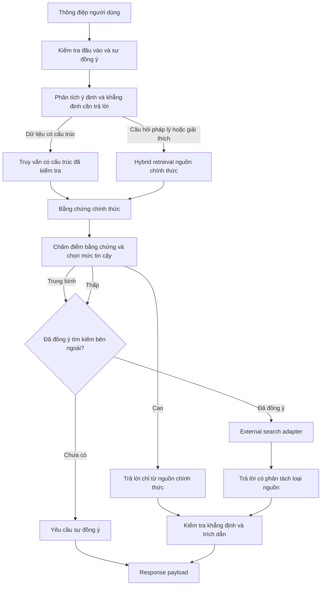

# ICIVI — Quy trình RAG Version 1

## 1. Mục tiêu tài liệu

Tài liệu này mô tả quy trình RAG cho ICIVI Version 1. Quy trình mở rộng các
nguyên tắc trong `00-overview.md`, `01-architecture.md`, `02-schema.md` và
`03-data-crawler.md` nhằm tạo câu trả lời có căn cứ, truy vết được nguồn và
không để LLM tự quyết định các quy định hành chính.

Quy trình hỗ trợ ba đường truy xuất:

- `structured_query`: tra cứu dữ liệu thủ tục, biểu mẫu và quy tắc đã được
  chuẩn hóa.
- `hybrid_rag`: truy xuất tri thức từ nguồn chính thức đã được kiểm duyệt và
  xuất bản.
- `external_search`: tham khảo nguồn bên ngoài tại thời điểm chạy khi thực sự
  cần thiết và đã có sự đồng ý của người dùng.

Kết quả của mỗi lần trả lời có `confidence_score` từ `0.0` đến `1.0` và
`confidence_band` để lựa chọn chiến lược sử dụng nguồn. `confidence_score`
trong Version 1 là điểm heuristic; chỉ được coi là điểm tin cậy đã hiệu chỉnh
sau khi được đánh giá trên tập dữ liệu đủ lớn.

## 2. Các nguyên tắc bất biến

- LLM chỉ phân loại ý định, tạo đặc tả truy vấn đã được kiểm tra và tổng hợp
  bằng chứng. LLM không được tự tạo quy định, số hiệu văn bản, trích dẫn hoặc
  câu lệnh SQL.
- Dữ liệu chính thức gồm `knowledge_document`, `knowledge_chunk`, FAQ và dữ
  liệu thủ tục/biểu mẫu có trạng thái `published`, còn hiệu lực và đúng địa
  bàn.
- Một khẳng định pháp lý chỉ được đưa ra khi có bằng chứng chính thức hỗ trợ.
  Nguồn bên ngoài không thay thế căn cứ pháp lý chính thức.
- Trích dẫn được tạo từ metadata của kết quả truy xuất, không được tạo từ nội
  dung do LLM sinh ra.
- Không sử dụng dữ liệu của tỉnh, huyện hoặc xã khác làm nguồn dự phòng. Khi
  thiếu dữ liệu địa phương, chỉ được dự phòng bằng bằng chứng `national` hợp
  lệ.
- Tin nhắn gốc, dữ liệu định danh cá nhân, nội dung thô từ nguồn bên ngoài và
  API secret không được ghi vào log, graph state, PostgreSQL hoặc knowledge
  base.

## 3. Kiến trúc và luồng xử lý



`structured_query` và `hybrid_rag` có thể chạy trong cùng một request. Ví dụ,
hệ thống lấy thời hạn giải quyết từ dữ liệu thủ tục có cấu trúc, đồng thời
truy xuất đoạn văn bản pháp lý giải thích điều kiện áp dụng. Tất cả bằng chứng
sau đó đi qua cùng một bước chấm điểm và kiểm tra trích dẫn.

## 4. Định tuyến theo ý định

### 4.1 Ý định và kế hoạch truy xuất

Node phân tích ý định phải trả về structured output như sau:

```json
{
  "intent": "legal_explanation",
  "retrieval_paths": ["structured_query", "hybrid_rag"],
  "procedure_code": "BIRTH_REGISTRATION",
  "form_code": null,
  "claim_types": ["processing_time", "legal_basis"],
  "jurisdiction_required": false,
  "search_query": "Thời hạn đăng ký khai sinh"
}
```

`procedure_code`, `form_code`, `claim_types` và `retrieval_paths` phải thuộc
allowlist do backend cung cấp. Khi không xác định được thủ tục, graph phải hỏi
một câu làm rõ trước khi truy xuất trên phạm vi corpus rộng.

### 4.2 Truy vấn có cấu trúc — Text-to-SQL an toàn

Truy vấn có cấu trúc được dùng cho các dữ kiện đã chuẩn hóa như tên thủ tục,
hồ sơ cần chuẩn bị, cơ quan tiếp nhận, thời hạn, lệ phí, trường biểu mẫu và
validation rule.

LLM không được sinh raw SQL. LLM chỉ được sinh `StructuredQuerySpec`:

```json
{
  "resource": "procedure_required_document",
  "select": ["field_code", "label_vi", "instruction_vi"],
  "filters": {
    "procedure_code": "BIRTH_REGISTRATION",
    "form_code": "BIRTH_REGISTRATION_FORM",
    "jurisdiction_scope": "national"
  },
  "sort": "jurisdiction_priority",
  "limit": 10
}
```

Query compiler service phải:

- Kiểm tra `resource`, `select`, `filters`, `sort` và `limit` theo allowlist có
  phiên bản được định nghĩa trong code.
- Tự động bổ sung điều kiện về trạng thái `published`, ngày hiệu lực, ngôn ngữ
  và địa bàn.
- Sử dụng parameterized query; không nối trực tiếp input của người dùng vào
  câu lệnh SQL.
- Từ chối column, operator, join, subquery, expression hoặc `limit` vượt quá
  policy. Lỗi trả về là `invalid_structured_query`; không retry bằng raw SQL.
- Trả về bằng chứng có đầy đủ provenance của thủ tục, biểu mẫu hoặc nguồn pháp
  lý liên quan.

### 4.3 Hybrid RAG cho tài liệu chính thức

Hybrid RAG chỉ truy xuất tri thức đã được xuất bản. Thứ tự thực hiện:

1. Xác định thủ tục, biểu mẫu, scenario, ngôn ngữ và địa bàn từ session/state.
2. Áp dụng metadata filter trước full-text search và vector search.
3. Tìm exact match cho số hiệu văn bản, mã thủ tục, mã biểu mẫu và tên pháp lý.
4. Chạy PostgreSQL full-text search và pgvector semantic search trên tập dữ
   liệu đã lọc.
5. Hợp nhất kết quả bằng Reciprocal Rank Fusion (RRF), với `k = 60`.
6. Xếp hạng lại theo độ bao phủ khẳng định, mức khớp địa bàn, độ mới và hiệu
   lực, mức ưu tiên nguồn, độ phù hợp của section và quan hệ pháp lý.
7. Tạo bằng chứng và trích dẫn từ các chunk được chọn.

Vector search không được chạy trên corpus chưa qua metadata filter khi context
về thủ tục hoặc địa bàn đã được xác định.

## 5. Metadata filter và phạm vi địa bàn

### 5.1 Điều kiện bắt buộc

Knowledge retrieval chỉ chấp nhận document/chunk thỏa mãn:

```text
knowledge_document.status = published
legal_source_version.status = published, nếu document có legal source
procedure_version.status = published, nếu document có procedure version
effective_from <= current_date, nếu có
effective_to is null hoặc effective_to >= current_date
language_code = session language hoặc bản dịch đã publish
```

Bổ sung filter theo `procedure_version_id` và `form_version_id` khi context đã
được xác định. FAQ cũng phải có `status = published`, đúng địa bàn và còn hiệu
lực theo metadata liên kết.

### 5.2 Ưu tiên địa bàn

Với địa bàn đã chọn, chỉ chấp nhận bằng chứng thuộc một trong các phạm vi sau:

1. `district` có đúng `administrative_area_id`.
2. `province` có đúng `administrative_area_id`.
3. `national`.

Kết quả được sắp theo thứ tự trên. Nếu không có bằng chứng `district` hoặc
`province` phù hợp, pipeline có thể sử dụng `national`; không được truy xuất
bằng chứng của địa phương khác.

Nếu khẳng định bắt buộc phải có dữ liệu địa phương nhưng chỉ có dữ liệu
`national`, hệ thống phải giảm điểm tin cậy và nêu rõ giới hạn trong response.

### 5.3 Ưu tiên căn cứ pháp lý phù hợp

Không được mặc định ưu tiên một loại văn bản chỉ dựa trên tên loại như Luật,
Nghị định hoặc Thông tư.

Khi `claim_types` chứa `legal_basis`, `eligibility`, `condition`,
`required_document` hoặc `legal_deadline`, reranker phải ưu tiên theo:

1. Văn bản được procedure version dẫn chiếu trực tiếp.
2. Văn bản còn hiệu lực và đúng phạm vi điều chỉnh.
3. Điều, Khoản hoặc Điểm trực tiếp hỗ trợ khẳng định.
4. Văn bản có hiệu lực pháp lý cao hơn khi các nguồn điều chỉnh cùng một vấn
   đề và không có quy định chuyên ngành hợp lệ khác.
5. Văn bản hướng dẫn chi tiết như Nghị định hoặc Thông tư khi câu hỏi cần nội
   dung triển khai cụ thể.

Việc tăng điểm cho Nghị định hoặc Thông tư chỉ áp dụng khi văn bản đó trực
tiếp hướng dẫn nội dung đang được hỏi; không được bỏ qua:

- Văn bản cụ thể do người dùng nêu và vẫn còn hiệu lực.
- Văn bản có hiệu lực pháp lý cao hơn.
- Văn bản được procedure version tham chiếu trực tiếp.
- Metadata về địa bàn, ngày hiệu lực và mức ưu tiên nguồn.

Bằng chứng được chọn phải giữ `legal_source_version_id`, hierarchy path và
section reference để trích dẫn đúng Điều, Khoản hoặc Điểm khi metadata có sẵn.

## 6. Bằng chứng và trích dẫn

### 6.1 Hợp đồng bằng chứng nội bộ

Tất cả đường truy xuất phải trả về cùng một kiểu bằng chứng:

```json
{
  "evidence_id": "uuid",
  "source_type": "government | external",
  "source_tier": "structured | legal | procedure_guide | faq | external",
  "title": "Luật Hộ tịch",
  "source_url": "https://...",
  "quote_preview": "...",
  "content": "Nội dung đã trích xuất để tổng hợp.",
  "legal_source_version_id": "uuid",
  "knowledge_chunk_id": "uuid",
  "procedure_version_id": "uuid",
  "jurisdiction_scope": "national",
  "administrative_area_code": null,
  "effective_from": "2016-01-01",
  "effective_to": null,
  "retrieval_score": 0.91,
  "rerank_score": 0.88,
  "claim_ids": ["legal_basis"]
}
```

Bằng chứng `external` không có `knowledge_chunk_id` và
`legal_source_version_id`; bằng chứng này chỉ tồn tại trong runtime của
request/session.

Nội dung bên ngoài phải được giới hạn theo size policy và không được ghi vào
Redis nếu có khả năng chứa dữ liệu định danh cá nhân từ trang nguồn.

### 6.2 Hợp đồng trích dẫn

Trích dẫn cho bằng chứng chính thức tuân theo `02-schema.md`. Trích dẫn nguồn
bên ngoài bổ sung `source_type = external` và không được chứa
`document_number` hoặc `section_reference` do LLM tự suy diễn.

```json
{
  "citation_id": "CIT-001",
  "source_type": "government",
  "knowledge_chunk_id": "uuid",
  "source_code": "DECREE_EXAMPLE",
  "source_title": "Nghị định ...",
  "document_number": "...",
  "section_reference": "Điều 16",
  "source_url": "https://...",
  "jurisdiction_scope": "national",
  "administrative_area_code": null,
  "quote_preview": "..."
}
```

Trước khi tạo output, citation verifier phải kiểm tra:

- Trích dẫn tham chiếu đến bằng chứng đã được truy xuất.
- Source version có đúng trạng thái và còn hiệu lực.
- Mỗi khẳng định pháp lý có ít nhất một trích dẫn chính thức hỗ trợ.

Nếu kiểm tra thất bại, hệ thống phải loại bỏ khẳng định đó hoặc hạ response
xuống `unable_to_verify`.

## 7. Chấm điểm tin cậy và chiến lược trả lời

### 7.1 Thành phần điểm

`confidence_score` là điểm có trọng số trong khoảng `0.0` đến `1.0`:

```text
0.35 * claim_coverage
+ 0.20 * source_authority
+ 0.15 * retrieval_quality
+ 0.15 * jurisdiction_match
+ 0.10 * freshness_and_version
+ 0.05 * consistency
```

Mỗi thành phần được giới hạn trong `[0.0, 1.0]`:

- `claim_coverage`: tỷ lệ khẳng định đã trích xuất có bằng chứng trực tiếp hỗ
  trợ.
- `source_authority`: `1.0` đối với nguồn chính thức đã được xuất bản; nguồn
  bên ngoài không đóng góp vào điểm kết luận pháp lý.
- `retrieval_quality`: điểm RRF/rerank đã chuẩn hóa và khoảng cách so với các
  kết quả cạnh tranh.
- `jurisdiction_match`: `1.0` cho đúng phạm vi địa bàn đã chọn, `0.75` cho
  trường hợp dự phòng bằng nguồn `national` hợp lệ và `0.0` cho phạm vi không
  hợp lệ.
- `freshness_and_version`: nguồn còn hiệu lực, version đã xuất bản và không có
  xung đột version.
- `consistency`: các bằng chứng hỗ trợ lẫn nhau và không có xung đột chưa được
  xử lý.

`confidence_reasons` là danh sách mã phục vụ hiển thị hoặc xử lý nội bộ, ví dụ:

```text
missing_local_guidance
partial_claim_coverage
conflicting_sources
expired_source_excluded
no_government_evidence
```

Trọng số và ngưỡng trong Version 1 là cấu hình ban đầu. Chúng phải được hiệu
chỉnh bằng golden dataset, human review và dữ liệu vận hành trước khi được coi
là xác suất tin cậy.

### 7.2 Quy tắc chọn mức tin cậy

- `high`: điểm `>= 0.80`, có bằng chứng chính thức đã xuất bản và còn hiệu lực
  hỗ trợ mọi khẳng định pháp lý, đồng thời không có xung đột chưa được xử lý.
  Chỉ sử dụng bằng chứng chính thức và trả lời kèm trích dẫn.
- `medium`: điểm từ `0.50` đến dưới `0.80`, có bằng chứng chính thức liên quan
  nhưng thiếu độ bao phủ, độ cụ thể hoặc cần thêm context. Chỉ thực hiện
  external search sau khi có sự đồng ý; phải phân tách rõ nguồn chính thức và
  nguồn tham khảo. Kết luận pháp lý chỉ được dựa trên bằng chứng chính thức.
- `low`: điểm `< 0.50` hoặc không có đủ bằng chứng chính thức. Có thể thực hiện
  external search sau khi có sự đồng ý và phải cảnh báo rằng nội dung chưa
  được xác minh chính thức.

Nếu mức là `low` nhưng chưa có sự đồng ý, response chỉ yêu cầu sự đồng ý và
không gửi truy vấn ra bên thứ ba.

Nếu người dùng từ chối, response là `unable_to_verify`, kèm hướng dẫn kiểm tra
trên cổng hoặc liên hệ cơ quan chính thức. Nếu external search không tìm được
bằng chứng sử dụng được, hệ thống cũng trả `unable_to_verify`.

### 7.3 Quy tắc tổng hợp

- `high`: chỉ truyền bằng chứng chính thức vào prompt generator.
- `medium`: prompt phải tách `official_evidence` và `external_evidence`, đồng
  thời gắn nhãn rõ từng phần. Kết luận pháp lý không được dựa trên nguồn bên
  ngoài.
- `low`: prompt bắt buộc có cảnh báo chuẩn hóa, liên kết nguồn bên ngoài và
  khuyến nghị liên hệ kênh chính thức. Không dùng các cụm từ xác nhận như
  “bạn phải” hoặc “quy định yêu cầu” nếu không có bằng chứng chính thức.
- Mọi khẳng định không có bằng chứng phải bị loại bỏ; không được suy đoán từ
  kiến thức nền của model.

## 8. Tìm kiếm bên ngoài và sự đồng ý

### 8.1 External search adapter

External search là service adapter phía server, độc lập với
crawler/importer. Interface tối thiểu:

```python
class ExternalSearchAdapter(Protocol):
    async def search(
        self,
        *,
        query: str,
        allowed_domains: list[str],
        timeout_seconds: float,
        max_results: int,
    ) -> list[ExternalSearchResult]: ...
```

Provider, API key, `allowed_domains`, timeout, giới hạn kết quả và retry policy
chỉ được cấu hình phía server.

Adapter phải:

- Áp dụng domain allowlist trước khi lấy kết quả.
- Trả về tiêu đề, URL, đoạn mô tả, nhà xuất bản và ngày xuất bản nếu có.
- Không tự động crawl, import, embedding hoặc publish kết quả bên ngoài.

### 8.2 Sự đồng ý theo session

Trước lần external search đầu tiên, chatbot phải thông báo rằng truy vấn có
thể được gửi tới dịch vụ tìm kiếm bên thứ ba và yêu cầu người dùng đồng ý rõ
ràng.

Sự đồng ý được lưu trong Redis theo session và hết hạn cùng TTL 30 phút:

```json
{
  "external_search_consent": true,
  "external_search_consent_at": "2026-07-18T10:00:00+07:00"
}
```

`external_search_consent` bổ sung cho `external_llm_consent`, không thay thế
sự đồng ý đối với LLM API bên ngoài.

Người dùng có thể từ chối. Khi đó hệ thống:

- Không retry external search.
- Không gửi truy vấn đã chuẩn bị tới bên thứ ba.
- Không lưu lựa chọn từ chối như một hồ sơ dài hạn.

### 8.3 Lưu giữ và an toàn dữ liệu

Đối với dữ liệu external search tại runtime:

- Không lưu raw HTML, nội dung trang, truy vấn tìm kiếm hoặc dữ liệu định danh
  cá nhân vào PostgreSQL, local filesystem, backup hoặc application log.
- Chỉ giữ metadata tối thiểu trong phạm vi request để tạo response và trích
  dẫn; xóa khi request kết thúc.
- Redis chỉ lưu sự đồng ý và retrieval summary không chứa nội dung thô bên
  ngoài.
- Log chỉ ghi request ID, kết quả adapter, latency, số lượng kết quả và mã lỗi.
- Lỗi, timeout, domain bị chặn hoặc provider error không được làm thay đổi bằng
  chứng chính thức; pipeline phải giảm mức tin cậy hoặc trả
  `unable_to_verify` phù hợp.

Quy định này chỉ áp dụng cho external search tại runtime, không áp dụng cho
nguồn chính thức được crawler/importer thu thập theo quy trình dữ liệu đã được
phê duyệt.

## 9. Response và runtime state

### 9.1 Response payload

Chat response bổ sung các trường sau:

```json
{
  "answer": "...",
  "answer_strategy": "high | medium | low | unable_to_verify",
  "confidence_score": 0.83,
  "confidence_band": "high",
  "confidence_reasons": [],
  "citations": [],
  "external_search_used": false,
  "external_search_consent_required": false,
  "warning": null
}
```

Frontend hiển thị `confidence_band`, không nhất thiết hiển thị giá trị số chi
tiết của `confidence_score`.

- `medium`: tách trích dẫn thành “Nguồn chính thức” và “Nguồn tham khảo bên
  ngoài”.
- `low`: hiển thị cảnh báo chuẩn hóa và liên kết nguồn bên ngoài.
- `unable_to_verify`: không được hiển thị như một câu trả lời đã được xác nhận.

### 9.2 LangGraph state

Bổ sung các trường runtime có TTL theo session:

```python
class ICIVIState(TypedDict, total=False):
    retrieval_plan: dict[str, Any]
    evidence_ids: list[str]
    confidence_score: float
    confidence_band: Literal["high", "medium", "low"] | None
    confidence_reasons: list[str]
    external_search_consent: bool
    external_search_used: bool
```

Chỉ lưu `evidence_ids`, điểm, mức tin cậy, lý do và citation metadata cần
thiết; không lưu embedding, toàn bộ legal corpus, nội dung thô bên ngoài hoặc
dữ liệu định danh cá nhân trong graph state.

Retrieval cache chỉ lưu kết quả từ nguồn chính thức theo metadata filter;
không cache external response theo session.

## 10. Giám sát và kiểm toán

Các metric local bắt buộc:

- Tỷ lệ `high`, `medium`, `low` và `unable_to_verify`.
- Retrieval latency theo exact search, full-text search, vector search, RRF,
  rerank và external search.
- Cache hit rate của retrieval trên nguồn chính thức.
- Tỷ lệ yêu cầu, chấp thuận và từ chối sự đồng ý.
- Tỷ lệ external search thành công, timeout, blocked domain và provider
  failure.
- Citation coverage, citation verification failure và số khẳng định pháp lý bị
  loại bỏ.
- Confidence calibration, Brier score, Expected Calibration Error (ECE) và số
  truy vấn không có bằng chứng.

Structured log chỉ chứa:

- Request ID.
- Session ID đã băm hoặc rút gọn.
- Graph node.
- Procedure/form code.
- Answer strategy.
- Confidence band.
- Metric.
- Error code.

Không log:

- Toàn bộ tin nhắn.
- Form input.
- CCCD.
- Số điện thoại.
- Email.
- Raw query.
- Raw page content.

## 11. Đánh giá và điều kiện xuất bản

### 11.1 Evaluation dataset

Mỗi evaluation case phải có:

```json
{
  "case_id": "RAG-001",
  "question": "...",
  "intent": "legal_explanation",
  "expected_paths": ["hybrid_rag"],
  "jurisdiction": {
    "scope": "province",
    "administrative_area_code": "..."
  },
  "expected_confidence_band": "high",
  "required_government_citation_ids": ["..."],
  "external_search_expected": false,
  "required_warning": null,
  "critical_legal_case": true
}
```

Dataset có ít nhất ba nhóm:

- Bằng chứng chính thức đầy đủ: kỳ vọng `high` và trích dẫn chính thức đúng.
- Bằng chứng chính thức thiếu, mơ hồ hoặc xung đột: kỳ vọng `medium`; nguồn
  bên ngoài chỉ bổ sung thông tin và không tạo kết luận pháp lý.
- Không có bằng chứng chính thức: kỳ vọng `low` hoặc `unable_to_verify`, có
  cảnh báo và xử lý sự đồng ý đúng chính sách.

### 11.2 Các kiểm thử bắt buộc

- Structured query chỉ chấp nhận query spec thuộc allowlist và parameterized
  SQL.
- Structured query không đọc `draft`, `archived`, dữ liệu hết hiệu lực, sai
  thủ tục hoặc sai địa bàn; filter, column hoặc operator không hợp lệ phải bị
  từ chối.
- Hybrid retrieval phải kiểm thử exact document number, semantic paraphrase,
  keyword search, RRF/rerank, national fallback và khả năng ngăn rò rỉ dữ liệu
  từ địa phương khác.
- Citation test: mọi khẳng định pháp lý ở mức `high` và `medium` phải có trích
  dẫn chính thức hợp lệ; LLM không thể tạo citation không có evidence.
- Consent test: không có network call khi chưa đồng ý hoặc đã từ chối; sự đồng
  ý hết hạn theo session; external evidence không được lưu bền vững.
- Response test: nhãn, cảnh báo, external citation và chiến lược trả lời phải
  đúng theo mức tin cậy.
- Scoring test: kiểm tra tác động của từng reason, ngưỡng `0.80` và `0.50`,
  xung đột nguồn và trường hợp thiếu local guidance.

### 11.3 Chỉ số và điều kiện xuất bản

Evaluation runner báo cáo:

```text
retrieval recall@k
citation precision
citation coverage
groundedness
band classification accuracy
Brier score
Expected Calibration Error (ECE)
```

Không publish knowledge package nếu bất kỳ critical legal case nào:

- Thiếu trích dẫn bắt buộc.
- Trả sai confidence band.
- Dùng external evidence làm căn cứ cho kết luận pháp lý.
- Truy xuất sai địa bàn hoặc sai phiên bản.
- Tạo khẳng định không được bằng chứng hỗ trợ.

## 12. Phạm vi và tính tương thích

- Quy trình tiếp tục sử dụng PostgreSQL, pgvector, Redis, FastAPI và LangGraph
  trong modular monolith đã được chọn cho Version 1.
- Không bổ sung crawler tự động cho runtime RAG, long-term web cache, tài khoản
  người dùng hoặc autonomous LLM agent.
- `knowledge_document`, `knowledge_chunk`, `legal_source_version`, citation và
  session retention hiện có tiếp tục là nguồn sự thật. Các trường mới chỉ bổ
  sung runtime contract, không làm thay đổi quy tắc xuất bản.
- API chi tiết của chat và sự đồng ý đối với external search sẽ được định nghĩa
  trong tài liệu API, nhưng phải tuân thủ response payload và retention policy
  trong tài liệu này.
